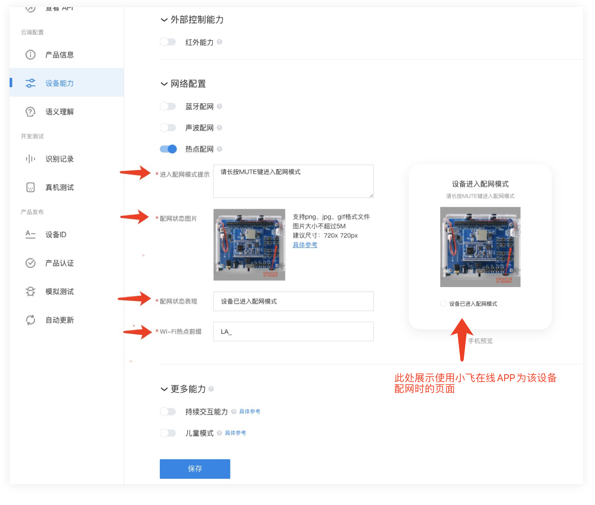
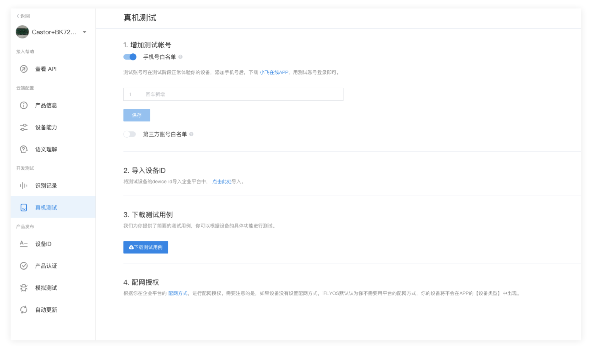

---

id: online_getting_start
title: 创建你的 iFLYOS 设备
slug: /CSK_online_guides/Create_iFLYOS_ equipment

---

> 本文主要介绍如何在 iFLYOS 上创建自己的设备，阅读本文后，你将了解到
>
> 1.如何在 iFLYOS 平台创建自己的设备；
>
> 2.如何查询设备在二次开发时需要的关键字段信息
>
> 3.如何导入设备，增加测试账号

在之前的文档中，你已经学会了如何上手使用 LSKits 离在线开发板，并制作自己的 CSK 固件。接下来，将为你介绍 [iFLYOS](https://www.iflyos.cn/) 云端在线功能的相关配置。iFLYOS 是聆思自主研发，基于人机智能交互技术为开发者开放的语音技术服务系统，接入 iFLYOS 的设备将具备丰富的语音交互能力。

## 1.在 iFLYOS 创建你的设备

登录 [iFLYOS](https://device.iflyos.cn/device) 平台并注册账号，选择设备接入后，点击【开始接入】，填写产品基本信息后，你需要选择产品类型，如下图：

**产品类型**：根据你的产品类型自行选择，如果是开发板，可选择【其他】；

**操作系统**：选择【RTOS】；

**是否有屏**：选择【无屏】；

**网络协议**：选择【EVS】；

选择产品类型后，你需配置设备能力，如下图；其中必备能力是设备必须要实现的能力，默认必须打开。在可选能力中，打开**【语音唤醒】**与**【热点配网】**两项能力。选择完成后，点击下一步，完成设备创建流程。

## 2.配网设置

创建设备后，你需要进行网络配置，当你使用小飞在线 APP 为设备配网时，这里的配置项内容会在 APP 中展示，你可以根据你的产品属性对内容进行设置。

**进入配网模式提示：**LSKits 开发板是通过长按 MUTE 键进入配网模式的，这里可以设置文案：“请长按 MUTE 键进入配网模式”；

**配网状态图片：**可以附上你的开发板图片，并标明 MUTE 键位置，方便配网者快速找到；

**配网状态表现：**此处描述设备已进入配网模式的表现；

**Wi-Fi 热点前缀：**设备打开 AP 热点后，对外显示的热点前缀，你可以根据自己的喜好对前缀进行设置；

在完成网络设置后，别忘了点击页面底部的【保存】按钮。

:::important

在 iFLYOS 平台设置 Wi-Fi 热点前缀后，还需在固件中同步修改。后面会讲到如何在固件中修改。

:::

## 3.Client id 与 OTA_SECET 获取

完成配网设置后，需要找到设备的 `Client id` 与 `OTA_SECRET`（加密密钥）；`Client_id` 表示该产品的在iFLYOS平台的唯一标识，`OTA_SECRET ` 是请求 iFLYOS OTA 接口时的签名认证，需要记住这两个参数的值，在编译 BK7251 固件时，需要将源码中这两项参数的默认值修改为该产品在 iFLYOS 的值。

## 4.导入设备 ID 白名单

创建设备后，你需要在【设备ID】菜单栏将你的 `Device_id` 导入至白名单中，如下图。`Device_id` 代表产品的设备在 iFLYOS 平台中的唯一标识，只有处于白名单中的 `Device_id`，才会通过平台鉴权，从而获取 iFLYOS 平台的语音服务。`Device_id` 格式可自己定义，导入后会在【已导入设备】一栏展示。

## 5.增加小飞在线测试账号

你需要使用【小飞在线】APP 为开发板进行配网，[点击此处](https://www.iflyos.cn/download/app/)下载。在登录小飞在线后，由于你的设备尚未通过认证，在APP端添加设备时，无法找到你的设备。你需要在下图【增加测试账号】栏，将你的小飞在线账号（即手机号）添加至白名单中。这样便可在添加设备时找到你的设备，完成后续配网授权流程，

## 6.了解更多

干的漂亮！通过上述操作，相信你对 iFLYOS 操作系统有了初步的了解。并在 iFLYOS 上成功创建了属于你的设备，可以[点击此处](https://doc.iflyos.cn/device/)，了解更多 iFLYOS 设备接入信息。

接下来，需要了解固件开发相关知识。让云端配置在固件端生效。

