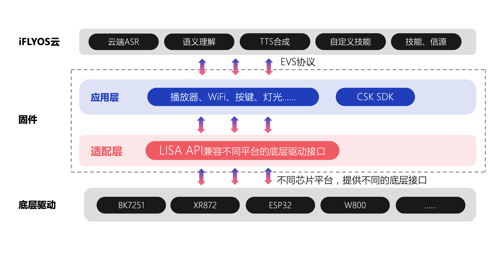

## 1.概述

Castor 离在线标准方案是基于聆思自研AI语音芯片 CSK ，结合 WiFi SOC （以下简称上位机） 以及讯飞云端语音操作系统 iFLYOS 打造的云端芯一体化解决方案。产品可基于该方案实现离线+在线语音交互，在线时 iFLYOS 丰富的语音技能与线上资源可满足用户绝大多数的语音交互场景；离线时可与产品自有 MCU 打通，实现本地语音控制；相较于纯离线语音交互，离在线方案支持更灵活的说法，使用场景更广。

通过该文档，开发者可全面了解离在线方案框架，并能够快速上手开发套件，针对自身产品需求进行二次开发，落地自己的离在线语音智能产品。

## 2.方案特点

方案具备如下特点：               

- 云端芯一体化

  聆思拥有自己的云端语音 OS、语音模组解决方案以及自研语音芯片，为客户提供全栈式服务

- 开发成本低

  聆思在芯片底层驱动与上层应用之间增加适配层（LISA API），开发者的上层应用无需对接底层驱动，只需对接 LISA API ，降低开发难度与成本。

- 代码易复用

  由于 LISA API 对硬件平台做了隔离与统一，因此开发者的上层应用在移植到不同硬件平台时也可以更快的复用，无需重复造轮子。

- 功能可配置

  方案将应用层源码分为数个子模块，并对模块间进行充分解耦，抽象出开发者可能需要自定义的功能项。开发者可根据实际需求对应用层功能进行快速配置。

## 3.方案链路说明

下图详细描述了离在线方案各个环节的运行机制，开发者可通过该流程图，快速了解方案整体运行逻辑。

### 3.1.CSK处理原始音频

设备端音频处理链路如下图所示，麦克风拾取人声后，将原始音频送至 ADC 。ADC 将模拟信号转换为数字信号后的音频传送至 CSK 芯片做前端声学处理，经过处理后将输出8路音频。

**本地识别**

CSK 选取经过前端声学处理后的两路音频 `e_lisa_csk_record_channel_cae1`、`e_lisa_csk_record_channel_cae2` 用于本地识别。如果用户语料被识别为本地命令词，CSK 可通过 UART 发送指令给上位机，实现业务逻辑。

**传音频至上位机**

在本地识别的同时，CSK 还会将4路音频传送至上位机，分别是 `e_lisa_csk_record_channel_mic1`（mic1的数据）、`e_lisa_csk_record_channel_mic2 `（mic2的数据）、`e_lisa_csk_record_channel_ref1 `（参考音频）、`e_lisa_csk_record_channel_cloud_asr `（送云端的音频），再由上位机将音频上传至云端完成在线语义理解。

### 3.2.CSK与上位机的通讯

**音频传输**

CSK 可通过 I2S 或 UAC 协议将音频传递至上位机。

**指令传输**

如果用户的语料命中本地命令词，CSK 可通过 UART 将事先约定好的指令发送至上位机 。具体串口指令可参考《 CSK 标准 UART 串口通信文档》。

**OTA**

上位机检测到云端有可用 CSK 更新后，可通过串口指令查询 CSK 当前固件版本；若本地版本小于云端版本，则上位机从云端下载更新，并将更新包通过串口协议发送给 CSK，由 CSK 自行完成固件更新。关于 OTA 的详细业务流程，后续将更新文档详细说明。

**心跳机制**

为确保 CSK 持续处于工作状态，聆思在 CSK 与上位机之间增加心跳机制，若 CSK 一段时间内未向上位机上报心跳，上位机将重新拉起 CSK。 关于心跳功能，可参考《 CSK 标准 UART 串口通信文档》。

### 3.3.上位机

离在线方案中的上位机，是指拥有连接互联网能力的 WiFi SOC。在整个方案中上位机会作为主处理器，处理各种业务逻辑。

**对接云端**

通过 AP 、BLE 等方式成功连接互联网，并通过 Websocket 与 iFLYOS 云保持通讯。

**EVS设备端实现**

以 EVS 协议为基础，实现设备端业务逻辑。包括语音识别器、音频播放器、闹钟、扬声器控制等，具体参考 LSCloud 中对应的上位机源码。为了保证更好的用户体验，聆思还实现了比较复杂的设备逻辑（如焦点管理等），具体可参考[《 EVS设备体验参考规范 》](https://doc.iflyos.cn/device/evs/appointment.html#evs%E8%AE%BE%E5%A4%87%E4%BD%93%E9%AA%8C%E5%8F%82%E8%80%83%E8%A7%84%E8%8C%83)。

**硬件交互**

包括灯光、按键等设备外设表现控制。

### 3.4.云—端通讯

云端与设备端通过 EVS （Embedded iFLYOS Voice Service）协议连接，协议采用 websocket 进行通讯。在整个交互过程中，设备发送到服务端的指令称为请求( Request ），设备接收到服务端的指令称为响应( Response )。

[点击此处](https://doc.iflyos.cn/device/evs/)，快速了解 EVS 协议。

### 3.5.iFLYOS云

iFLYOS 是科大讯飞基于人机智能交互技术开放的语音技术服务操作系统，全链路聚合了语音唤醒、语音识别、语义理解、内容（信源）平台、语音合成等单点能力。此外，iFLYOS 拥有200+技能与千万级音视频资源，

[点击此处](https://doc.iflyos.cn/device/#%E8%AE%BE%E5%A4%87%E6%8E%A5%E5%85%A5%E6%AD%A5%E9%AA%A4)，快速了解 iFLYOS 接入步骤。

### 3.6.第三方云

#### 3.6.1.自定义语义

若 iFLYOS 的技能与信源无法满足开发者，需要通过第三方云端实现个性化需求。或开发者有自己的语义理解服务。可在 iFLYOS 技能工作室创建[自定义技能](https://doc.iflyos.cn/studio/#%E6%8A%80%E8%83%BD%E5%BC%80%E5%8F%91%E6%AD%A5%E9%AA%A4)，完成 iFLYOS 与第三方云端的云云对接。

#### 3.6.2 .IoT云

若开发者有自己的 IoT 云，希望当用户说智能家居语料时能够命中自己的 IoT云，同时也可命中接入 iFLYOS 其他品牌的智能家居。开发者可通过[接入 iFLYOS 智能家居控制服务](https://doc.iflyos.cn/service/iot/#%E6%99%BA%E8%83%BD%E5%AE%B6%E5%B1%85%E6%8E%A7%E5%88%B6%E6%9C%8D%E5%8A%A1%E7%AE%80%E4%BB%8B)的形式实现功能。

若开发者有自己的IoT云，希望当用户说智能家居控制语料时，能够调用自己的 IOT 云而非 iFLYOS 官方 IOT 云。可创建自定义技能，编写智能家居相关的意图语料，以及后处理。待技能开发、调试完成后，再将技能配置在iFLYOS的[前拦截器](https://doc.iflyos.cn/device/upgrades/interceptor.html#%E8%87%AA%E5%AE%9A%E4%B9%89%E6%8B%A6%E6%88%AA%E5%99%A8)上，即可实现需求。

### 3.7.设备MCU

家电产品通常会自带一颗用于设备控制的 MCU，当用户语料命中特定离线命令词或云端语义后，上位机可通过 UART 发送事先约定好的指令给 MCU，从而通过语音实现本地控制 。

### 3.8.离/在线模式优先

在实际体验产品时，会出现用户语料同时命中离线命令词语与云端技能的情景。此时上位机将先后收到CSK传来的串口讯息以及 iFLYOS 下发的指令。上位机可根据产品的使用场景，设计不同的处理方式：

- 如果语音功能以自控制为主，且对响应速度有较高要求，建议设置为优先采用本地结果，云端结果作为离线结果的补充，如按摩椅、取暖桌等。

- 对于以在线语音交互为主的产品，建议使用在线优先，如智能音箱、投影仪等。

此外，上位机还可根据网络状态进行判断，若产品无网络或网络不可用，则优先采用离线结果。

需要注意的是，离线优先可能会导致串扰。如设置一个离线命令词“播放”，当用户说“播放刘德华的歌”时，也会命中离线命令词，造成用户无法正常点播歌曲。所以在设计离线命令词时，需要仔细斟酌，尽量避免离线命令词与用户常用语料造成冲突。

## 4.二次开发

当开发者理解方案架构并能够上手使用开发套件后，便可进入二次开发环节。针对不同需求的开发者，聆思提供了不同的解决方案。

### 4.1.采用聆思已适配的上位机，云端接入 iFLYOS

#### 4.1.1.获取源码

开发者可从 LSCloud 下载固件应用层与适配层源码，由于聆思已针对上位机底层进行适配，开发者可直接复用适配层与应用层源代码。

#### 4.1.2.个性化语义开发

若开发者有个性化语义的需求，可根据需求选择合适的实现方式：

- 单轮语音问答，可在 [iFLYOS 技能工作室](https://studio.iflyos.cn/index-studio)创建[问答](https://doc.iflyos.cn/studio/#%E9%97%AE%E7%AD%94)或[设备人设](https://doc.iflyos.cn/device/upgrades/portrait.html#%E8%AE%BE%E5%A4%87%E4%BA%BA%E8%AE%BE)实现

- 若需实现以下较复杂场景，可通过[创建自定义技能](https://doc.iflyos.cn/studio/#%E6%8A%80%E8%83%BD%E5%BC%80%E5%8F%91%E6%AD%A5%E9%AA%A4)实现
  - 多轮对话，如追问
  - 获取语义后，需要定制业务流程（如调用接口、第三方信源等）

- 如果开发者有自己的语义处理服务，可将回调地址配置在[拦截器](https://doc.iflyos.cn/device/upgrades/interceptor.html#%E8%87%AA%E5%AE%9A%E4%B9%89%E6%8B%A6%E6%88%AA%E5%99%A8)中；

#### 4.1.3.固件应用层二次开发

如果开发者对固件应用层功能有二次开发的需求，如按键、灯光、TTS提示音、自定义技能设备端实现等，可参考[《CSK 离在线方案固件二次开发文档》](www)。

### 4.2.采用聆思未适配的上位机，云端接入 iFLYOS

如果开发者选择聆思未适配的 WiFi SOC，则需要基于 LISA API 的标准接口，对芯片底层驱动做适配工作。

#### 5.2.1.适配芯片底层驱动

基于[《LISA_API参考手册》](www)，将 WiFi SOC 的底层驱动转换成 LISA API 的标准接口格式，完成固件适配层开发工作。

#### 4.2.2.获取源码

从 LSCloud 下载基于 LISA_API 实现的上位机源码，参考 LISA_API 的实现方式

#### 4.2.3.云端&固件应用层二次开发

可参考 5.1.2 与 5.1.3 中的二次开发指引。

### 4.3.采用聆思已适配的上位机，云端接入第三方语音云

如果开发者对接其他语音云，那么聆思提供的应用层源码开发者将无法直接复用。

#### 4.3.1.获取源码

从 LSCloud 获取上位机 LISA API 源码。

#### 4.3.2.应用层开发

基于[《LISA API参考手册》](www)以及源码，实现应用层业务逻辑。

### 4.4.采用聆思未适配的上位机，云端接入第三方语音云

由于聆思之前并未对该上位机进行适配，且应用层也未接入iFLYOS，所以 LSCLoud 中的 LISA API 与应用层源码均无法直接复用。

- 可基于[《LISA API 参考手册》](www)对接上位机底层驱动，将底层接口转换为 LISA API 定义的标注接口，实现适配层开发
- 基于适配层提供的标准接口，实现应用层业务逻辑

## 5.硬件设计参考

在进行二次开发的同时，开发者也可开始着手设计硬件。为了帮助开发者快速落地，聆思提供了硬件参考设计，开发者可根据产品需求，选择对应的硬件参考设计。

[CSK4002+XR872AT+ESP7210参考设计](www)

[CSK4002+XR872AT+ESP7210+AC6956C参考设计](www)

[CSK4002+BK7251+ESP7210参考设计](www)

完成硬件设计后，可在 LSCLoud 上提交[工单](https://doc.iflyos.cn/csk/lscloud/creat_issue.html#%E5%B7%A5%E5%8D%95)，上传结构图、原理图、PCBA、产品规格书等资料。聆思硬件专家将进行评审，确保硬件设计合理。若通过评审，开发者可开始落地项目。聆思将全程提供技术支持。

## 6.常见问题指引

针对开发者在 CSK+XR872AT 二次开发过程中经常会遇到的软、硬件问题，聆思提供了[《 CSK+XR872AT 离在线方案Q&A》](www)（ CSK+BK7251 即将更新，敬请期待）。若查看Q&A后，问题仍未解决，可前往请前往 [LSCloud](https://cloud.listenai.com/users/sign_in) 提交[工单](https://doc.iflyos.cn/csk/lscloud/creat_issue.html#%E5%B7%A5%E5%8D%95)，聆思 FAE 将第一时间帮助你解决问题。

