## 1.说明

CSK4002/CSK3002 产测模式可以对 CSK4002/CSK3002 核心模组进行基本硬件检测。产测代码和正常代码集成在一个固件里面，CSK4002/CSK3002 芯片上电后通过判断产测触发引脚的状态来决定进入产测或正常运行。

## 2.产测项

CSK芯片检测分为音频检测和硬件连通性检测。

1. 音频检测：包括以下两条通路：

   - 录音通路：MIC 音频经过 ADC 到 CSK 芯片的音频通路
   - 播音通路：CSK 芯片通过 SPK 播放音频的通路
2. 硬件连通性检测：包含 GPIO 的连通性检测。

:::note

`4002纯离线方案`与`3002纯离线方案`产测项有所不同

   - `4002音频检测`：包括MIC频率检测结果，MIC一致性检测结果，REF 信号检测结果。

   - `3002音频检测`：包括MIC频率检测结果，MIC一致性检测结果。

:::

## 3.产测配置

提供了可供用户配置的产测配置，来适应不同的产测需求。

`hardware.toml`：可通过该硬件配置文件，配置产测涉及的芯片硬件引脚，如：

- 产测触发引脚
- 音频检测结果输出引脚
- 和其他 GPIO 引脚

`application.toml`：可通过该软件配置文件，配置产测涉及的产测开关和触发电平，如：

- 产测检测开关
- 产测触发有效电平

### 3.1 hardware.toml

`hardware.toml` 文件的`factory_gpio`字段就是产测引脚的硬件配置，包含下表 3 个字段:


| 引脚分类 | 说明 |
| - | - |
| `check_enter` | 产测模式触发检测引脚：通过检测此引脚的电平来决定是否进入产测模式；只能配 1 个引脚，只能为输入 |
| `check_record` | 音频检测结果输出引脚：用来输出音频检测结果（依次为 MIC频率检测结果，MIC一致性检测结果，REF 信号检测结果）；只能配 3 个引 脚，只能为输出 |
| `check_gpios` | GPIO连通性测试引脚：用来检测 GPIO 的硬件连通性，CSK 会控制这些引脚的电平，最多可配置 10 个引脚， 只能为输出 |

下面是其中引脚的字段的说明


| 键名 | 键值 | 说明 |
| - | - | - |
| `tag` | `name` | pin脚的名字，用户可指定 |
| `pin` | `1~64` | CSK芯片的引脚，具体参考Datasheet |
| `mux` | `0~4` | pin 脚的复用功能 |
| `dir` | `true`<br/>`false` | 引脚设置为输出<br/>引脚设置为输入 |
| `def` | `true`<br/>`false` | 当引脚设为输出时，输出的逻辑电平为高<br/>当pin脚设为输出时，输出的逻辑电平为低 |
| `rev` | `true`<br/>`false` | 逻辑电平和物理电平一致<br/>逻辑电平和物理电平相反 |

`hardware.toml` 的`factory_gpio`字段示例如下：

```js
[factory_gpio]

  # 通过此引脚来决定是否进入产测模式；
  # 只能配1个引脚；
  # 只能为输入dir = false
  [factory_gpio.check_enter]
  tag = "enter"
  pin = 12
  mux = 0
  dir = false

  # 用来输出音频检测结果（依次为 MIC频率检测结果,MIC一致性检测结果,REF 信号检测结果）；只能配3个引脚，只能为输出（dir = true）。
  [[factory_gpio.check_record]]
  tag = "record0"
  pin = 38
  mux = 0
  dir = true
  def = false
  rev = false

  [[factory_gpio.check_record]]
  tag = "record1"
  pin = 47
  mux = 0
  dir = true
  def = false
  rev = false

  [[factory_gpio.check_record]]
  tag = "record2"
  pin = 57
  mux = 0
  dir = true
  def = false
  rev = false

  # 用来检测 GPIO 的硬件连通性，CSK 控制这些引脚的电平，最多可配置10个引脚，只能为输出（dir = true）。
  [[factory_gpio.check_gpios]]
  tag = "gpio0"
  pin = 46
  mux = 0
  dir = true
  def = false
  rev = false

  [[factory_gpio.check_gpios]]
  tag = "gpio1"
  pin = 42
  mux = 0
  dir = true
  def = false
  rev = false

  [[factory_gpio.check_gpios]]
  tag = "gpio2"
  pin = 24
  mux = 0
  dir = true
  def = false
  rev = false

  [[factory_gpio.check_gpios]]
  tag = "gpio3"
  pin = 26
  mux = 0
  dir = true
  def = false
  rev = false

  [[factory_gpio.check_gpios]]
  tag = "gpio4"
  pin = 35
  mux = 0
  dir = true
  def = false
  rev = false

  [[factory_gpio.check_gpios]]
  tag = "gpio5"
  pin = 55
  mux = 0
  dir = true
  def = false
  rev = false

  [[factory_gpio.check_gpios]]
  tag = "gpio6"
  pin = 56
  mux = 0
  dir = true
  def = false
  rev = false

  [[factory_gpio.check_gpios]]
  tag = "gpio7"
  pin = 59
  mux = 0
  dir = true
  def = false
  rev = false

  [[factory_gpio.check_gpios]]
  tag = "gpio8"
  pin = 62
  mux = 0
  dir = true
  def = false
  rev = false
```

### 3.2 application.toml

`application.toml` 的`factory`字段包含了`产测开关`以及`产测触发电平`的配置，如下图：

```js
#产测配置
[factory]

# 产测开关，决定上电是否进行产测模式检测。
enable = false

# 注意：只有产测开关打开，才会进行产测模式检查，从而有可能进入产测模式。
# 如果产测开关关闭，即便配置了产测其他字段，流程上实际也不会用到。
# 检查进入产测模式的触发电平条件，false：低电平；true：高电平。
check_enter_level = false

# 预留配置，暂未使用。检测进入产测模式触发电平的延迟时间。
check_gpios_delay = 2
```

## 4.产线烧录流程

产线烧录流程包括`固件烧录`和`SN烧录`，均在`CastorFactoryTool`量产工具上完成。

### 3.1 获取量产包

用户可从LStudio工程根目录`release`目录获取到量产包`release.zip`
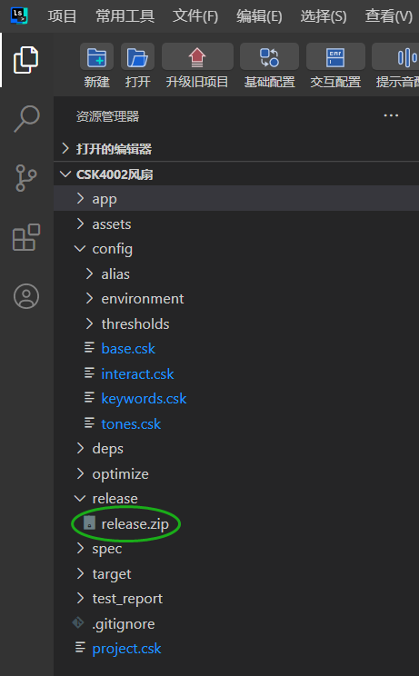

将`release.zip`解压，解压后的目录中找到量产固件包，量产固件包的命名规则为`项目名-版本号-factory.csk`

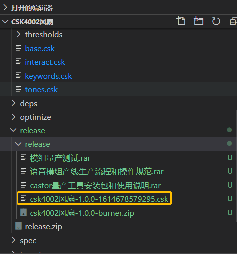


### 3.2 打开量产烧录工具

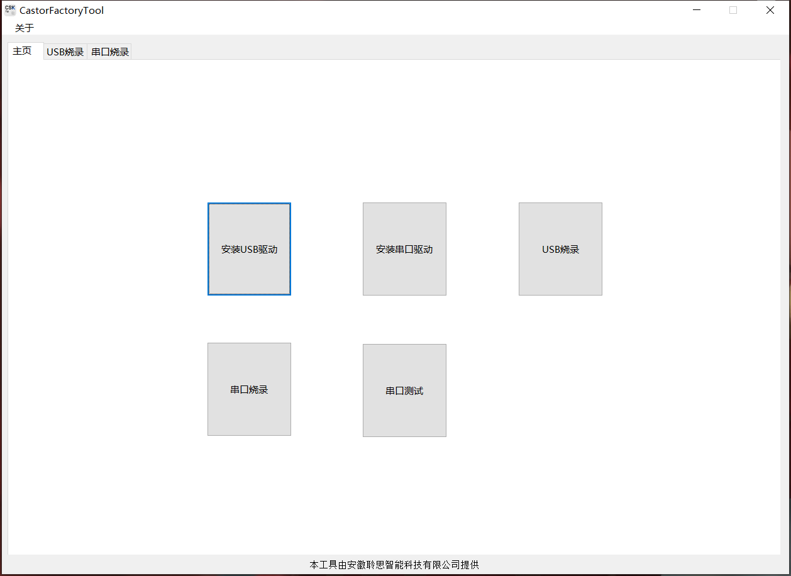

### 3.3 安装USB驱动

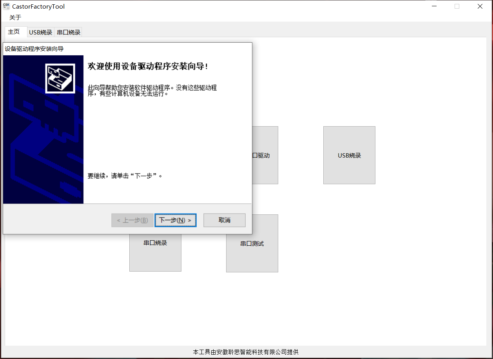
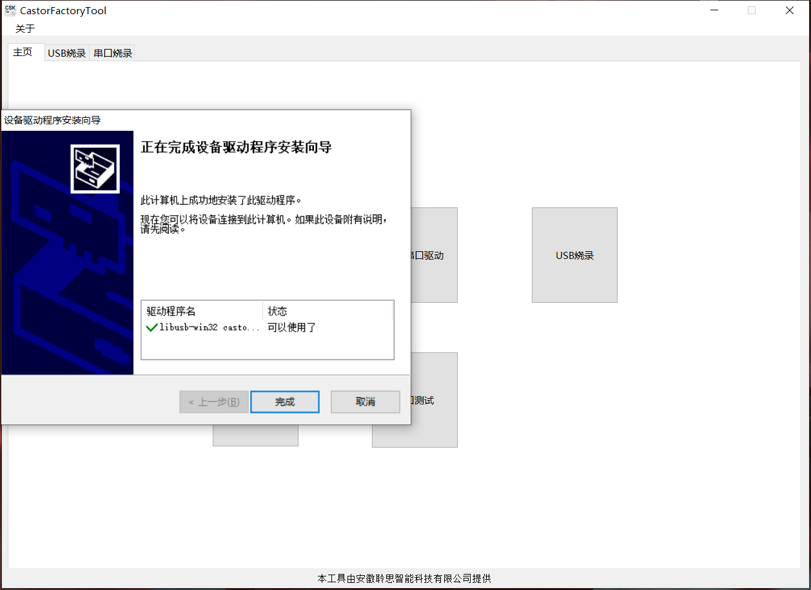

### 3.4 选择USB烧录

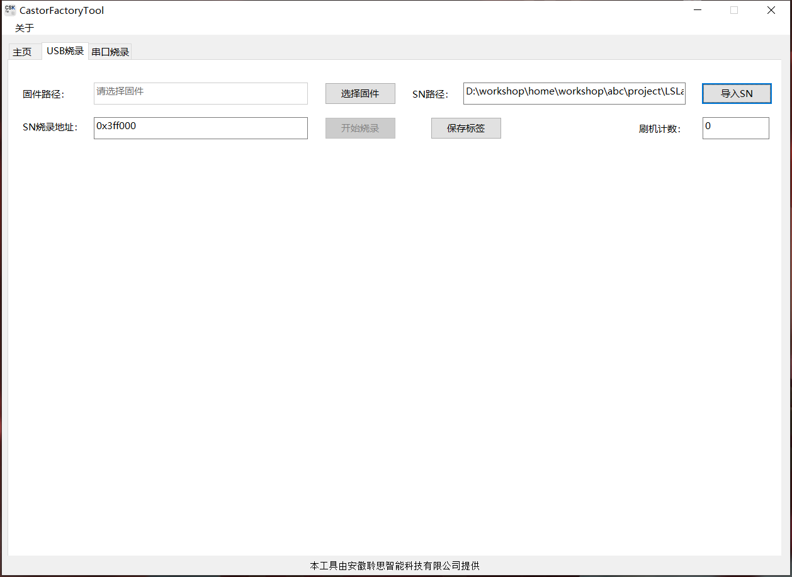

### 3.5 选择并导入量产固件包

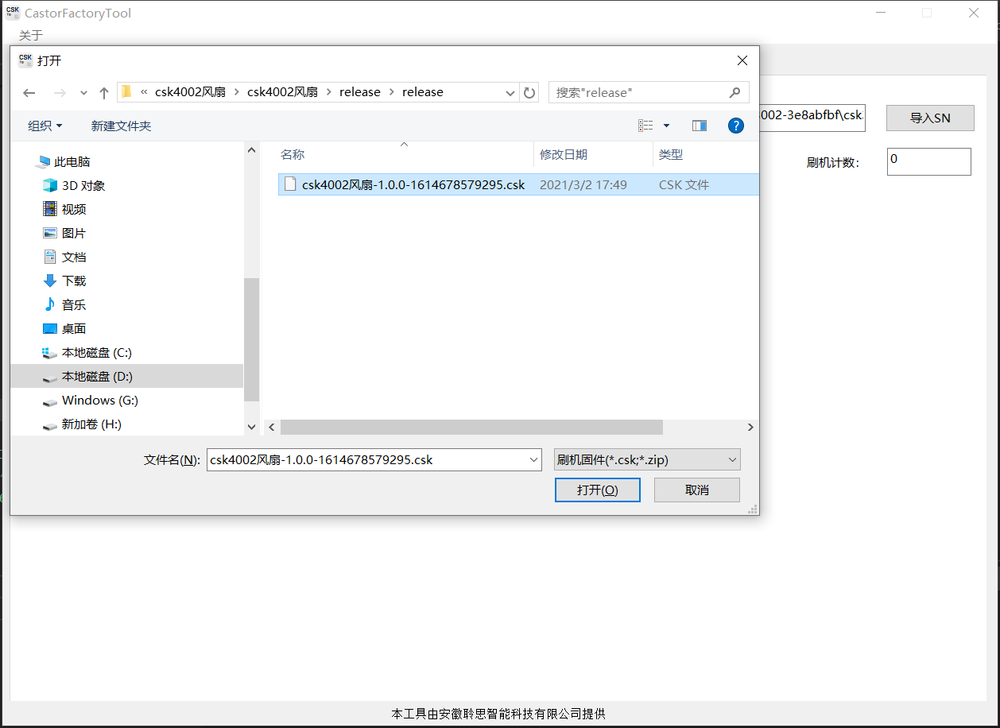

### 3.6 准备SN序列号文件

SN序列号列表文件格式说明如下:

1. SN列表采用以半角`,`分隔的`.csv`文件储存
2. 每行存一个SN号，共两列信息：
   - 列1：SN号，列1的字符串格式为`键值对`的形式，一个合法的SN号格式应为`SN={SN号};`
     - 键：`SN`
     - 键值：`{SN号}`
     - 键值对分割符：半角的`;`表示结束，作为键值对分割符。
   - 列2：SN号烧录标志位，表示是否已经烧录
     - 0（表示未烧录）
     - 1（表示已烧录）
3. 每行以Windows下的CRLF结尾。

示例：

```shell
SN=0001;,0
SN=0002;,0
```

当SN1被烧录后，文件内容变为：

```shell
SN=0001;,1
SN=0002;,0
```

一个符合标准的`SN.csv`文件内容如下图：
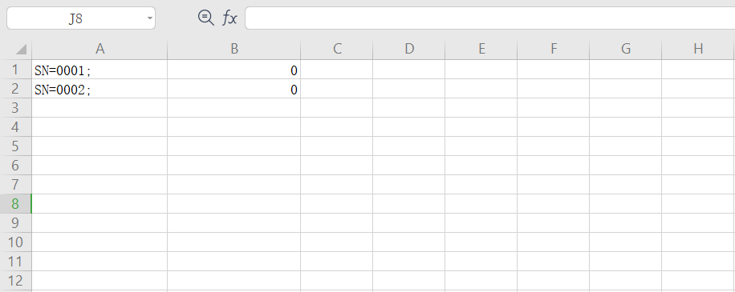

:::note

注意：原始的.csv必须包含两列，且列2的取值是0，以用于占位

:::

### 3.7 导入SN序列号文件

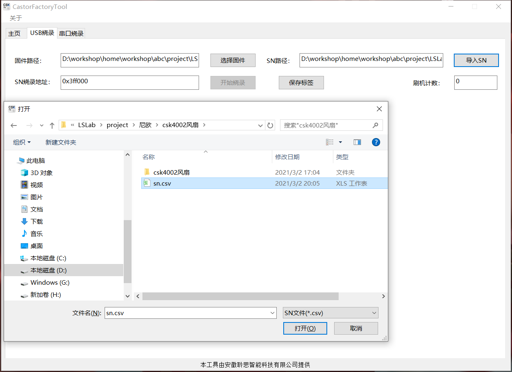
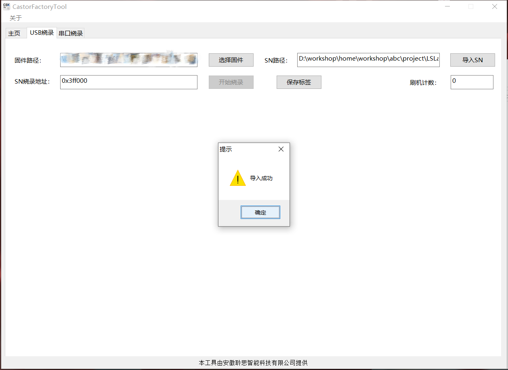

### 3.8 填写SN烧录地址

- 3002的SN烧录地址为`0x3ff000`(4M Flash中最后一页，共计4K空间)
- 4002的SN烧录地址为`0x7fe000`(8M Flash中最后两页，共计8K空间)

### 3.9 开始烧录

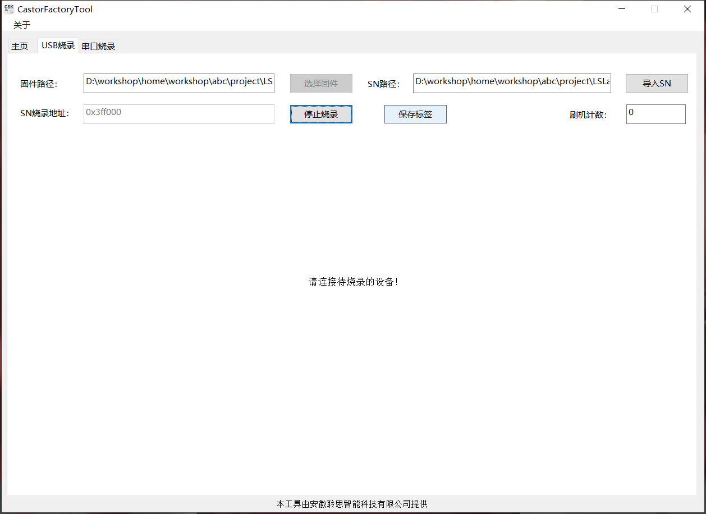
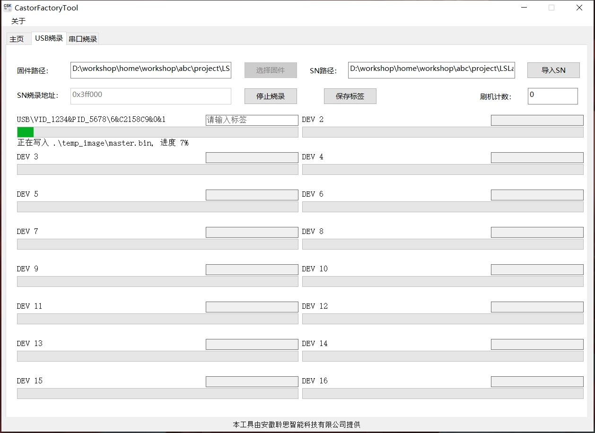

### 3.10 烧录完成

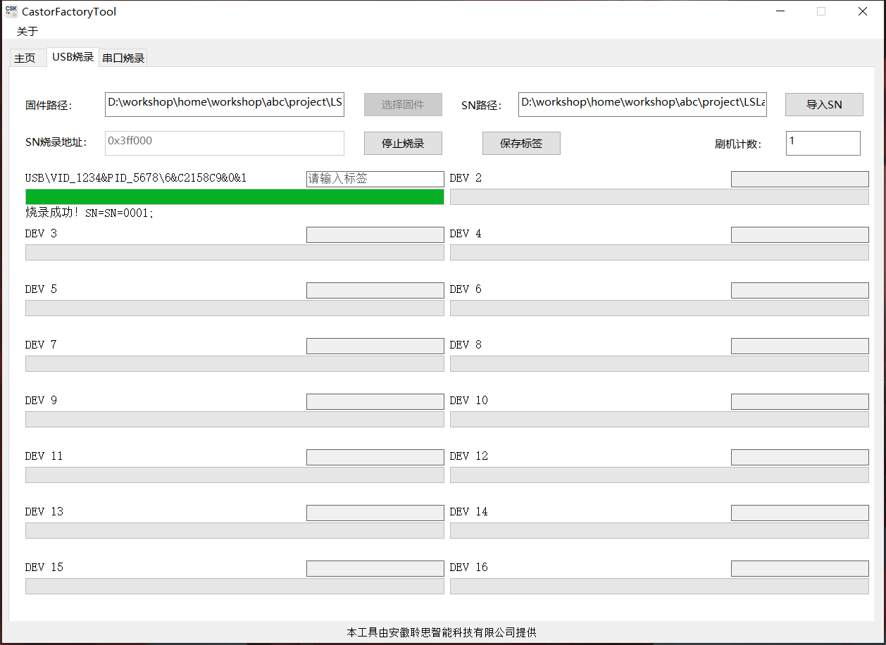

## 5.产测流程

产线烧录流程结束之后，接下来一般会进行产测流程，以管控生产质量。

`CSK4002/CSK3002`核心模组的产测流程如下：

1. 上电检测产测触发引脚`check_enter`，如果检测电平状态为`check_enter_level`设置的电平，就进入产测模式
2. 进入产测模式后，打印当前的固件版本

```c
taskcreate(log_task): 00017cc0~0001bcc0

[CSK-COMMIT]pub-2.0.1@92d9912|CAE@3002.B3001.v1.beta1|ESR@3002.1210.V2.beta1
[VER]pub-2.0.1@92d9912
[CID]C00000001-V4658-P3143-R7468009D00
```

3. 顺序执行产测项
   - 音频检测: 通过自播自录，自动通过 SPK 播放音频，同时通过 `2 个 MIC` 和 `回采信号` 进行录音
     - 如果 `MIC频率` 检测通过，则相应引脚设置为逻辑高，否则为逻辑低
     - 如果 `MIC一致性` 检测通过，则相应引脚设置为逻辑高，否则为逻辑低
     - 如果 `回采信号` 检测通过，则相应引脚设置为逻辑高，否则为逻辑低
     - 音频检测完成后，通过`日志串口`输出`音频检测结果`和`SN`号 （以CSK3002音频产测结果为例）
       ```c
       [1]Frequency Check=>[PASS]
       [2]Two Mic Same=>[PASS]
       [3]SN=>[abcd1234]
       ```
     - 当`音频检测结果`均为`PASS`并且`SN`不为空，认为产测通过，通过串口日志输出最终产测结果
       ```c
       ########################################
       ##  ######     ##     #####   #####   ##
       ##  ##   ##   ####   ##   ## ##   ##  ##
       ##  ##   ##  ##  ##  ##      ##       ##
       ##  ######  ##    ##  #####   #####   ##
       ##  ##      ########      ##      ##  ##
       ##  ##      ##    ## ##   ## ##   ##  ##
       ##  ##      ##    ##  #####   #####   ##
       ########################################
       ```
     - 当`音频检测结果`有一项为`FAIL`或者`SN`为空，认为产测失败，通过串口日志输出最终产测结果
       ```c
       ########################################
       ##  #######    ##    ######  ##       ##
       ##  ##        ####     ##    ##       ##
       ##  ##       ##  ##    ##    ##       ##
       ##  #####   ##    ##   ##    ##       ##
       ##  ##      ########   ##    ##       ##
       ##  ##      ##    ##   ##    ##       ##
       ##  ##      ##    ## ######  #######  ##
       ########################################

       ```
   - 硬件通断性检测: 对`check_gpios`中配置的GPIO引脚的默认逻辑电平取反
