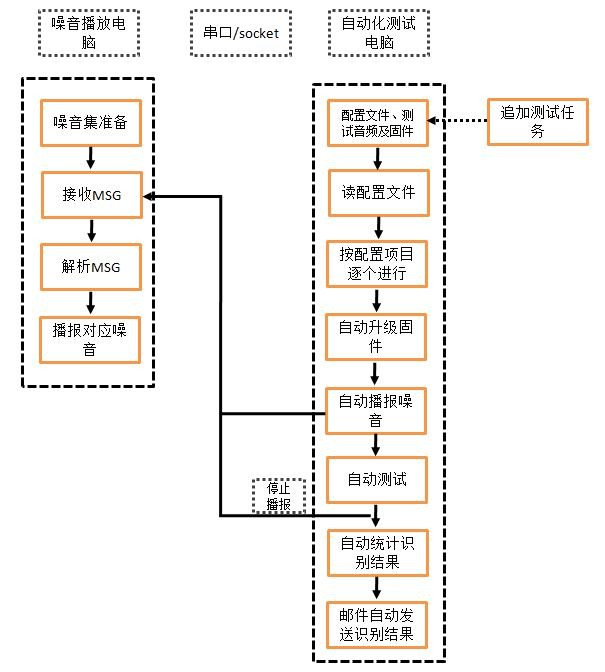
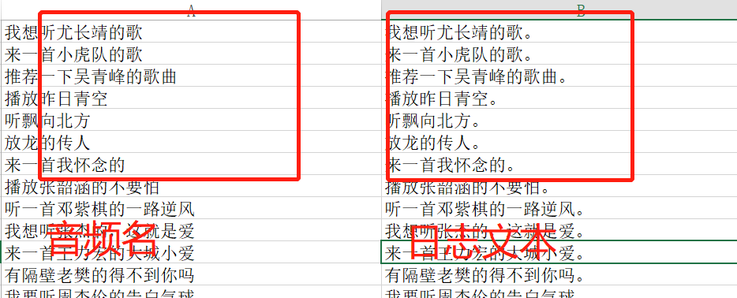
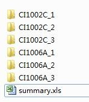
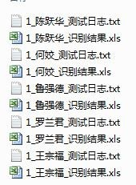

通过LStudio，您可以进行自动化测试唤醒、识别、误唤醒、回放采集。通过简单的配置，就可以快速的构建一个可维护的测试项目，进行流程化、可复用的自动化测试。

## 一些准备

### 测试音频

#### 测试音频准备

在测试开始前，首先您需要获取**测试加密音频和密钥**。

请使用聆思账号登入[LSCloud]（https://cloud.listenai.com/users/sign_in），新建一个工单。

`添加供应商登录页面`

选择**测试音频录制**，按要求填写词表和数量等必填项，并指派给聆思FAE。

`添加供应商提交词表页面`

聆思FAE接收到您提交的工单后，开始安排音频的录制、下载、幅值调整等工作，然后会将加密音频发送给您。

#### 导入加密音频

收到了加密音频文件后，在LStudio点击**加密音频导入**按钮，选择后缀名为`.lap`的压缩包进行导入。

`添加“加密音频导入”按钮图`

音频导入成功后，可以在 **spec\dataset\audio_original** 文件夹查看。

#### 解密播放音频

完成加密音频的导入后，接下来需要对音频进行解密。

请打开工程树中 **test.csk** 文件，将 **decrypt_key** 设置为解密秘钥所在路径。

（注意：路径需要进行转义，如 **E:\dataset** 需写成 **E:\\\dataset**）

#### 原始音频导入

如果您有用于测试的自录音频，也可以导入通过LStudio用于测试。

请将原始音频按照命令词文本分文件夹存放，如：**parent/打开空调/xxxxxx.wav** 。

请在 **parent** 文件夹中，存放一个音量较大的唤醒词音频，并命名为 **wakeup_{唤醒词}.wav** 。如： **parent/wakeup_小飞小飞.wav**。

（注意：播报音频的文件夹必须与预期输出结果的一样，因为内部是通过正则表达式匹配来判定识别正确与否。）

### 测试设备

测试音频准备就绪后，需要准备测试设备进行测试环境布置，基础要求如下：

| 设备                     | 作用                                                         |
| ------------------------ | ------------------------------------------------------------ |
| 音响支架及高保真音箱*2   | 1个用于放置播放唤醒词的高保真音箱 1个用于放置播放噪音的高保真音箱 |
| 个人笔记本电脑*2         | 1个用于播放唤醒语料 1个用于播放噪声语料                 |
| 声级计*1                 | 用于噪声、混响、声源信号强度测量，计算信噪比等               |
| 量角器/角度测量装置*1    | 用于测量方位角，放置播放唤醒词/噪声的高保真音箱和麦克风阵列设备等 |
| 卷尺*1                   | 用于测量设备之间的距离                                       |
| 音频线*若干（至少 2 条） | 用于将笔记本电脑连接到高保真音箱的音频线                     |

（注意：若有声卡设备可使用一台笔记本电脑同时控制两台音箱，不同场景下，噪音和唤
 醒语料要在同一个时间点开始播放，同一个时间点结束播放。）

## 开始测试

### 自动化测试流程

LStudio的自动测试原理如图所示。

一台为噪音播放电脑（存放需要用到的噪音集），另一台运行自动化测试工具；串口连接语音模块板到自动化测试电脑。自动化测试电脑上需要配置连接好串口，再在自动化测试工具目录里配置好音频文件和测试参数后即可开始自动化测试。

配置好文件并测试音频和固件正常后，运行自动化测试工具就会开始读取配置文件，按照事件顺序确认串口信息和测试音频正常时，开始执行测试，自动测试结束即自动统计识别结果生成文档，最后邮件自动发送识别结果到指定邮箱。

### 工具文件介绍

**dataset**：用于存放语料音频文件

**target**：用于存放效果测试结果

**test.csk**：自动测试配置文件，默认已自动生成一个名称为测试设备的设备，4个不同类型的测试任务（唤醒、识别、误唤醒、回放采集）

### test.csk文件配置方法

#### 设备[[auto_test.devices]]中常用参数

| 参数               | 说明                                                         |
| ------------------ | ------------------------------------------------------------ |
| name               | 设备名                                                       |
| serial_port        | 串口号，用于读取设备运行日志                                 |
| address            | 录音设备地址，用于读取设备录音。非必填，若不填或填错则不保存此设备的录音 |
| baut_rate          | 串口读取波特率，不配置则默认使用 `115200`                    |
| record_format      | 录音格式，用于剪辑录音和录音数据监测。非必填，若不填则不保存此设备的录音 |
| algo_record_format | 用于在线测试/自动调优的录音数据格式，不填则保持和 **record_format** 一致 |
| wakeup_regex       | 唤醒词匹配正则表达式，非必填，若不声明则使用CSK默认正则      |
| recognize_regex    | 识别词匹配正则表达式，非必填，若不声明则使用CSK默认正则      |
| asr_exit_regex     | 超时日志匹配正则表达式，非必填，若不声明则使用CSK默认正则    |

#### 任务[[auto_test.tasks]]中常用参数

| 参数               | 说明                                                         |
| ------------------ | ------------------------------------------------------------ |
| name               | 人物名                                                       |
| type               | 任务类型，目前支持4种（wake_up、recognize、mistake_wake_up、record_only） |
| voice_directory    | 语料音频路径，默认是项目下的dataset，用户可指定为电脑上的其他路径 （例如：E:\dataset，需要写成E:\\\dataset） |
| silence_duration   | 播放两个音频间的间隔时间，单位为秒                           |
| recognize_timeout  | 识别超时时间，单位为秒。离线场景根据固件内配置设置，在线场景酌情配置，唤醒成功后，超过 {recognize_timeout} 秒没有识别结果则重新播放唤醒音频，未唤醒不会等待 |
| upload_oss_enabled | true代表上传录音音频，false代表不上传但是仍会保持到本地，提供作为自动调优任务音频 |
| recognize_one_shot | true是一次唤醒一次交互、false代表一次唤醒多次交互，待超时后再唤醒 |
| asr_online         | 配置是否在线识别，在线识别会使用比离线识别更长一点的等待时间，以避免因为网络问题造成误判（默认等待10s） |

### 一般测试流程

1. 创建实验室项目

   开始进行测试，需要新建一个实验室项目。

   请点击菜单栏中的 `新建` 按钮，选择 `实验室项目` 。填写完基本信息点击确定完成项目创建后，请点击工程树中的 **test.csk** 配置文件按照实际需求进行配置。

2. 查看串口和录音地址

   打开 **test.csk** 文件，然后点击右上角的 `···` 按钮。

   在弹出的页面中分别点击 **显示当前可用的串口设备** 和 **显示当前可用的录音设备** ，可以查看串口和录音设备信息。若查询到的录音设备为空，请检查固件是否支持USB录音功能。

3. 将步骤1查询到的串口和录音地址替换到 **test.csk** 里 **auto_test.devices** 中 **serial_port** 

   与 **address**

   

4. 若固件支持usb录音，修改为对应固件支持的录音格式 **record_format** 、 **algo_record_format** ( 例如：16k16bit6ch)

   | 取值  | 含义   | 实际数值 |
   | ----- | ------ | -------- |
   | 16k   | 采样率 | 16000Hz  |
   | 16bit | 波特率 | 16位     |
   | 6ch   | 通道数 | 6        |

   在固件测试前后，都可能需要进行离线测试或自动调优，来对设备效果进行分析、调试，因此保存设备录音时会单独生成一个 **algo** 文件夹，用于提供给离线测试工具或自动调优工具使用。

   

5. 指定任务中**voice_directory**

   **方法一**：使用默认路径 **voice_directory = “./dataset”** ，将音频复制到 **dataset** 下

   **方法二**：指定为电脑上的存放音频的其他路径 （例如：**E:\dataset**，需要写成**E:\\\dataset**）

   

6. 点击右上角的执行按钮，选择对应的任务执行，任务启动后，会根据当前时间、项目名、任务名、任务类型创建目录，目录下会包含以下文件：

   | 文件夹      | 文件目录                                                     | 说明                                                         |
   | ----------- | ------------------------------------------------------------ | ------------------------------------------------------------ |
   | test_result | \- 时间_${项目名}${任务名}${任务类型} \- result_${串口号}_${设备名}.csv | result_${串口号}_${设备名}.csv为测试记录以及结论统计         |
   | log         | \- 时间_${项目名}${任务名}${任务类型} -device_log \- serial_${串口号}_${设备名}.log -tool.log | serial_${串口号}_${设备名}.log为设备串口日志 tool.log为聆思工作站运行日志 |
   | audio       | \- 时间_${项目名}${任务名}${任务类型} -audio -audio_record -${设备名} -target.txt -xx.pcm | 目录内的音频为所设置通道的PCM音频，目录下存在一个 target.txt文件，描述音频文件与词条名的对应关系。该目录的产物可用作调优工具的输入音频 |

   

### 常用场景参考

1. 在线识别场景

   recognize_one_shot = true

   asr_online = true

   wakeup_regex、recognize_regex、asr_exit_regex

   

2. 竞品离线测试场景

   通过 **baut_rate** 设置竞品日志支持的串口波特率

   wakeup_regex、recognize_regex、asr_exit_regex

   

3. 竞品在线测试场景

   在竞品离线测试场景下开启如下配置项：

   recognize_one_shot = true

   asr_online = true

   

4. 多设备测试场景

   复制原有的一个 **[[auto_test.devices]]** ，然后修改对应的name、serial_port、address等信息

   

备注：test.csk中想要注释部分区域可以通过选中若干行配置后，按下键盘ctrl+/的方式进行注释，加载配置时则会忽略这些配置

### 映射表

当日志中的文本与音频文件夹不一致时，可以通过映射表在两者之间建立关联联系。

只需要在音频路径下，新建 **word_map.csv** 文件。文件中的第一列填写音频文件夹名称，第二列写日志的中文文本。

### 正则表达式

在设备配置中，**wakeup_regex**, **recognize_regex**, **asr_exit_regex**分别代表不同场景下用来判断设备状态的正则，各自的要求也有所不同。

#### 匹配唤醒、识别日志

**wakeup_regex** 和 **recognize_regex** 分别代表要对唤醒和识别进行匹配，因此需要精确匹配到日志中代表唤醒词或识别词的语句。

#### 匹配退出识别日志

**asr_exit_regex**用于表示认为已经退出了识别的日志。在实际场景中，一次唤醒设备，设备可能可以进行多次识别，因此我们需要找到设备已经不再进行识别的日志，以保证测试工具可以在正确的时机播放唤醒词音频来唤醒设备。

在正则表达式的语法中，匹配到语句时，第一个 `group` 代表是语句本身，而后表达式中的剩余部分如果有括号 `()` 括起，则会按顺序匹配到后续的 `group` 中。例如：

> 如果使用 `.+aaa.+` 来匹配 `bbbaaabbb` ，那么第一个 `group` 就是 `bbbaaabbb`。表达式中没有括号，所以整个匹配只有一个 `group`。

> 如果使用 `.+(aaa).+` 来匹配 `bbbaaabbb` ，那么此时会有两个 `group` ，第一个是语句本身 `bbbaaabbb` ，第二个 `group` 为 `aaa`。

实际使用过程可以先使用 [Regexr 网站](https://regexr.com/) 进行测试，输入表达式和测试日志后，下方就会显示匹配结果。点击 `Details` 就可以看到匹配到的所有 `group` ，这样可以确定是否真正匹配到了唤醒词或者识别词。

## 测试结果

当测试完成后，识别结果会在工作目录的 **result** 目录显示：

`搬运第四部分第一张图`

### 各项目平均识别率汇总

以测试六个项目、按五人次播报为例，**summary.xls** 为五测试个人声播报完成后的，每个项目的平均识别率：

`搬运4.1附图`

### 各项目的识别详细情况

以上图中 `Cl1002C_1` 为例：

`搬运4.2第一张附图`

***.txt** 为每个人每个命令词的详细识别情况，测试工具测试过程中自动或强制退出时，该文件仍保留。

`搬运4.2第二张附图`

***.xls** 为每个人每个命令词的详细识别情况及最终的平均识别率，是有在某一个人的测试音播报完成后才能生成。

`搬运4.2第三张附图`

