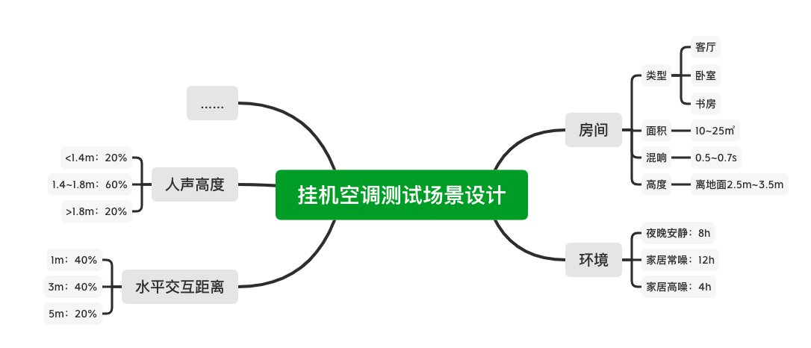
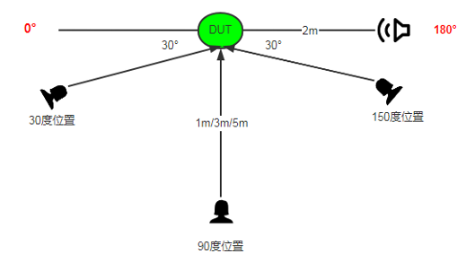
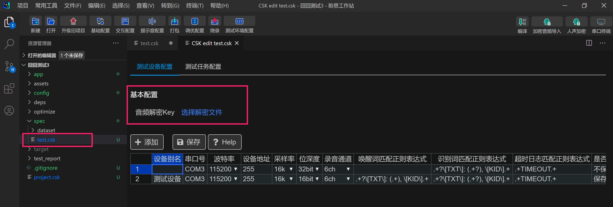
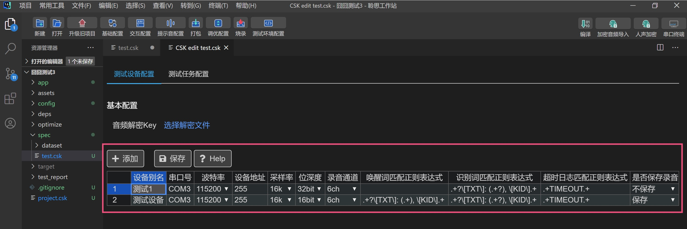
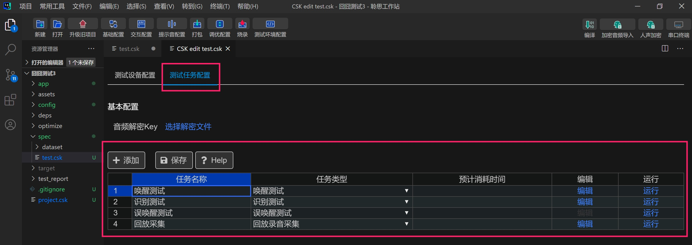

>本篇介绍如何使用声学实验室进行自动化语音效果测试。
读完本文后，你将学习到：
- 怎么针对产品进行测试场景设计。
- 怎么准备测试用例。
- 怎么使用LStudio进行自动化测试。


通过LStudio，您可以进行自动化测试唤醒、识别、误唤醒、回放采集。通过简单的配置，就可以快速的构建一个可维护的测试项目，进行流程化、可复用的自动化测试。

## 1.实验室搭建

聆思智能提供了3种实验室搭建方案，**[点击下载](https://open.listenai.com/resource/open/doc_resource%2F%E8%AF%AD%E9%9F%B3%E4%BA%A4%E4%BA%92%E6%95%88%E6%9E%9C%E6%B5%8B%E8%AF%95%2F%E8%81%86%E6%80%9D%E6%99%BA%E8%83%BD%E4%B8%93%E4%B8%9A%E5%A3%B0%E5%AD%A6%E5%AE%9E%E9%AA%8C%E5%AE%A4%E9%83%A8%E7%BD%B2%E6%96%B9%E6%A1%88.pdf)**

## 2.测试场景设计

### 2.1 分析设备的主要使用场景

以空调挂机为例，分析产品使用场景


在以上场景中，根据优先级排序，在测试时，优先保障优先级高的场景。

### 2.2 摆放设备

实验室设备摆放需尽量还原产品的真实使用场景。

以空调挂机为例，设备与噪音（图中喇叭所示）、人声的距离&角度示意图如下所示：




## 3.测试用例准备

### 3.1 人声音频准备

在测试开始前，首先您需要获取**测试加密音频和密钥**。

请使用聆思账号登入[LSCloud](https://cloud.listenai.com)，新建一个工单。


选择**测试音频录制**，按要求填写词表和数量等必填项，并指派给聆思FAE。


聆思FAE接收到您提交的工单后，开始安排音频的录制、下载、幅值调整等工作，然后会将加密音频发送给您。

:::caution
准备人声音频需要时间，一般来说，在提交申请之后3个工作日内，聆思会提供音频。为了避免影响项目进度，请提前提交人声音频申请。
:::

### 3.2 噪声音频准备

根据要测试的场景，请提前准备好噪声音频。噪声音频可自行录制或自行网络下载，并保存在播放噪声音频的电脑上。

### 3.3 误唤醒音频准备

建议使用电视剧、音乐等资源作为误唤醒测试集。

## 4 LStudio配置

### 4.1 自动化测试流程

- 一台电脑运行自动化测试工具，串口连接语音模块板到自动化测试电脑。

- 自动化测试电脑上需要配置连接好串口，在自动化测试工具目录里配置好音频文件和测试参数后即可开始自动化测试。
- 配置好文件后，运行自动化测试工具开始读取配置文件，执行测试。
- 自动测试结束即自动统计识别结果生成文档。

### 4.2 导入加密人声音频

收到聆思FAE发送的加密音频文件后，在LStudio点击`加密音频导入`按钮，选择后缀名为`.lap`的压缩包进行导入。


音频导入成功后，可以在以下文件夹查看：
```
|--spec
|  |--dataset
|  |  |--audio_original
```

:::note
聆思FAE在给你发送加密音频文件时，会同步发送解密密钥。请妥善保管密钥，谨防遗失或泄露。
:::


### 4.3 原始音频导入

如果您有用于测试的自录音频，也可以导入通过LStudio用于测试。

请将原始音频按照词条文本分文件夹存放，如：`./打开空调/xxxxxx.wav`。

请在文件夹中，存放一个音量较大的唤醒词音频，并命名为 `wakeup_{唤醒词}.wav` 。如： `./wakeup_小飞小飞.wav`。

```
|--parent文件夹
|  |--wakeup_小飞小飞.wav
|  |--打开空调
|  |  |--xxxxx1.wav
|  |  |--xxxxx2.wav
|  |--关闭空调
|  |  |--xxxxx1.wav
|  |  |--xxxxx2.wav
```

:::caution 注意
播报音频的文件夹必须与预期输出结果的一样，因为内部是通过正则表达式匹配来判定识别正确与否。
:::

### 4.4 自动测试配置


请打开工程树中的 `test.csk`文件

#### 基本配置

**填入解密key**

聆思提供的人声测试音频是加密音频，需要解密才可以播放。请在`[auto_test] decrypt_key = "本地路径"`填入解密Key本地路径。

<!-- 点击【选择解密文件】，在本机中选择解密文件，点击【确定】

 -->

:::note
聆思FAE在给你发送加密音频文件时，会同步发送解密密钥。请妥善保管密钥，谨防遗失或泄露。
:::

#### 测试设备配置

<!-- ////图片会更新

若有多个测试设备，请点击【添加】，配置完成后请点击【保存】

**配置项说明：** -->

`[[auto_test.devices]]`

|字段| 选项含义 | 说明 |示例 |
| --| -- | -- |-- |
| name| 设备别名 | 设备名称将会在测试报告中显示，请填写方便辨认的设备名称 |"测试设备" |
| serial_port| 串口号 | 读取设备运行日志的串口号，按下图指引获取 |"COM3" |
| baut_rate| 波特率 | 读取设备运行日志的串口波特率，请根据实际串口波特率选择 |115_200 |
| address| 设备地址 | 用于读取设备录音的USB地址，按下图指引获取 |255 |
| algo_record_format| 采样率 | 录音音频采样率，仅支持16k |"16k32bit6ch" |
| algo_record_format| 位深度 | 录音音频为深度，支持16bit和32bit |"16k32bit6ch" |
| algo_record_format| 录音通道 | 录音音频的音频通道数，支持1ch，3ch，6ch |"16k32bit6ch" |
| wakeup_regex| 唤醒词正则表达式 | 读取日志后，LStudio将通过正则表达式判断设备是否正确唤醒，请根据设备日志正确设置。 |".+?\\[TXT\\]: (.+), \\[KID\\].+" |
| recognize_regex| 命令词正则表达式 | 读取日志后，LStudio将通过正则表达式判断设备是否正确命中命令词，请根据设备日志正确设置。 |".+?\\[TXT\\]: (.+?), \\[KID\\].+" |
| asr_exit_regex| 超时日志匹配正则表达式 | 读取日志后，LStudio将通过正则表达式判断设备是否识别超时，请根据设备日志正确设置。 |".+TIMEOUT.+" |
| save_audio| 是否保存录音 | 保存录音可用于本地调试和自动调优，建议保存。录音保存到本地，请保证本机有足够的存储空间。 |true |

<!-- ///缺获取串口号和设备地址的图 -->

#### 测试任务配置 

 `[[auto_test.tasks]]`

 |字段| 选项名称 | 说明 |示例 |
|--| -- | -- |-- |
|name| 任务名称 | 测试任务名称将会在测试报告中显示，请填写方便辨认的测试任务名称 |"唤醒测试" |
|type| 任务类型 | 目前支持唤醒测试、识别测试、误唤醒测试、回放采集 4个任务。 |"wake_up" |
|silence_duration| 静音时间段 | 音频和音频之间的静音时间段，单位为s |3 |
|recognize_timeout| 识别超时时间 | 唤醒后的识别超时时间，请按照真实情况填写 |20 |
|upload_oss_enabled| 上传音频 | 是否上传音频 |false |
|voice_directory| 音频来源 | 请选择测试音频所在的文件夹 |"./spec/dataset/audio_original" |


<!-- ////图片会更新

若有不同类型的测试任务，请点击【添加】，配置完成后请点击【保存】 -->

<!-- 配置项说明：

|字段| 选项名称 | 说明 |示例 |
|字段| -- | -- |-- |
|字段| 任务名称 | 测试任务名称将会在测试报告中显示，请填写方便辨认的测试任务名称 |示例 |
|字段| 任务类型 | 目前支持唤醒测试、识别测试、误唤醒测试、回放采集 4个任务。 |示例 |


任务说明：

| 任务类型 | 说明 |
| -- | -- |
| 唤醒测试 | 连续播放唤醒音频，仅统计唤醒率。 |
| 识别测试 | 播放唤醒词音频+命令词音频，会统计唤醒率和识别率 |
| 误唤醒测试 | 统计误唤醒次数 |
| 回放采集 | 录音保存 |

点击【编辑】可编辑任务详情

////图片会更新

配置项说明：

| 选项名称 | 说明 |
| -- | -- |
| 静音时间段 | 音频和音频之间的静音时间段，单位为s |
| 识别超时时间 | 唤醒后的识别超时时间，请按照真实情况填写 |
| 上传音频 | 是否上传音频，为了方便聆思FAE协助定位问题，建议选择`true` |
| 音频来源 | 请选择测试音频所在的文件夹 | -->

### 4.5 映射表

当日志中的文本与音频文件夹不一致时，可以通过映射表在两者之间建立关联联系。

只需要在音频路径下，新建 **word_map.csv** 文件。文件中的第一列填写音频文件夹名称，第二列写日志的中文文本。


### 4.6 正则表达式

在设备配置中，**wakeup_regex**, **recognize_regex**, **asr_exit_regex**分别代表不同场景下用来判断设备状态的正则，各自的要求也有所不同。


#### 匹配唤醒、识别日志

**wakeup_regex** 和 **recognize_regex** 分别代表要对唤醒和识别进行匹配，因此需要精确匹配到日志中代表唤醒词或识别词的语句。


#### 匹配退出识别日志

**asr_exit_regex**用于表示认为已经退出了识别的日志。在实际场景中，一次唤醒设备，设备可能可以进行多次识别，因此我们需要找到设备已经不再进行识别的日志，以保证测试工具可以在正确的时机播放唤醒词音频来唤醒设备。

在正则表达式的语法中，匹配到语句时，第一个 `group` 代表是语句本身，而后表达式中的剩余部分如果有括号 `()` 括起，则会按顺序匹配到后续的 `group` 中。例如：

> 如果使用 `.+aaa.+` 来匹配 `bbbaaabbb` ，那么第一个 `group` 就是 `bbbaaabbb`。表达式中没有括号，所以整个匹配只有一个 `group`。

> 如果使用 `.+(aaa).+` 来匹配 `bbbaaabbb` ，那么此时会有两个 `group` ，第一个是语句本身 `bbbaaabbb` ，第二个 `group` 为 `aaa`。


实际使用过程可以先使用 [Regexr 网站](https://regexr.com/) 进行测试，输入表达式和测试日志后，下方就会显示匹配结果。点击 `Details` 就可以看到匹配到的所有 `group` ，这样可以确定是否真正匹配到了唤醒词或者识别词。


## 5.运行自动测试

<!-- /// 缺自动测试运行中的图片 -->

点击右上角的执行按钮，选择对应的任务执行，任务启动后，会根据当前时间、项目名、任务名、任务类型创建目录，目录下会包含以下文件：

| 文件夹      | 文件目录                                                     | 说明                                                         |
| ----------- | ------------------------------------------------------------ | ------------------------------------------------------------ |
| test_result | \- 时间_${项目名}${任务名}${任务类型}<br />\- result_${串口号}_${设备名}.csv | result_${串口号}_${设备名}.csv为测试记录以及结论统计         |
| log         | \- 时间_${项目名}${任务名}${任务类型}<br />-device_log<br />\- serial_${串口号}_${设备名}.log<br />-tool.log | serial_${串口号}_${设备名}.log为设备串口日志<br />tool.log为聆思工作站运行日志 |
| audio       | \- 时间_${项目名}${任务名}${任务类型}<br />-audio<br />-audio_record<br />-${设备名}<br />-target.txt<br />-xx.pcm | 目录内的音频为所设置通道的PCM音频，目录下存在一个 target.txt文件，描述音频文件与词条名的对应关系。该目录的产物可用作调优工具的输入音频 |

## 6.测试结果

所有测试运行完成之后会在终端显示结果显示如下。


不同类型的测试产生的文件夹名称如下，分别对应识别、唤醒、误唤醒、回放采集。


每个测试类型下都会产生audio、log、test_result三个文件夹。


audio\audio_record\测试设备下产生的pcm文件和target可供离线测试和调优使用。

log文件夹中会记录测试过程中设备和串口日志。

拓展阅读
[聆思智能前端声学综合效果评估及测试标准](https://open.listenai.com/resource/open/doc_resource%2F%E8%AF%AD%E9%9F%B3%E4%BA%A4%E4%BA%92%E6%95%88%E6%9E%9C%E6%B5%8B%E8%AF%95%2F%E5%89%8D%E7%AB%AF%E5%A3%B0%E5%AD%A6%E7%BB%BC%E5%90%88%E6%95%88%E6%9E%9C%E8%AF%84%E4%BC%B0%E5%8F%8A%E6%B5%8B%E8%AF%95%E6%A0%87%E5%87%86_v1.1.pdf)