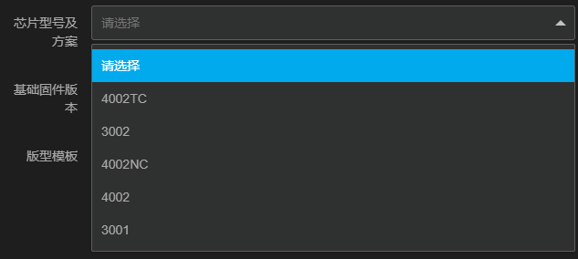
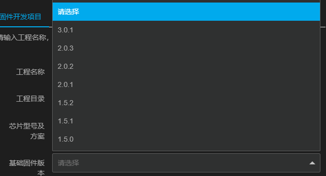
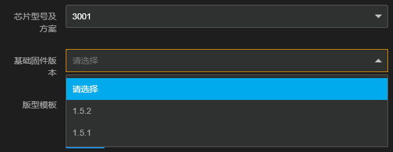
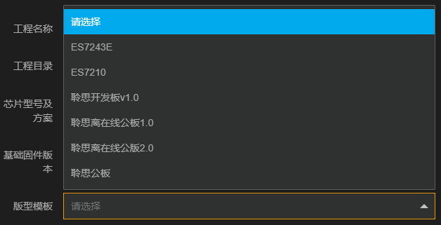
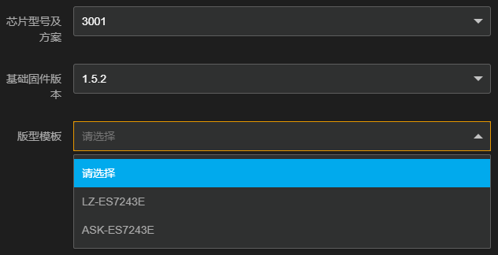
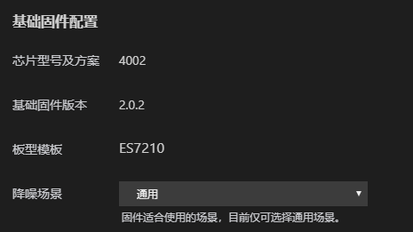
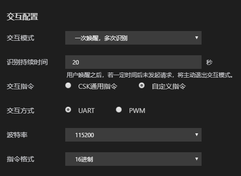

# CSK项目基础配置

:::note

本文将介绍如何进行CSK固件项目的基础配置。

阅读本文后，你将了解：

- 如何选择合适的语音芯片方案

- 如何创建语音芯片方案的固件开发项目

- 理解基础配置项，并按需求完成配置

:::

## 芯片介绍

| 芯片           | 3001                 | 3002                 | 4002                               |
| :------------- | :------------------- | :------------------- | :--------------------------------- |
| 综合唤醒率     | 90%                  | 95%                  | 95%                                |
| 麦克风阵列     | 1mic                 | 2mic                 | 2mic                               |
| 功耗           | 60mA@3.6V            | 60mA@3.6V            | 130mA@3.6V                         |
| 支持编程语言   | c mruby/c         | c mruby/c         | c mruby/c                       |
| 内存           | 1M SRAM              | 1M SRAM              | 1MB SRAM 8MB PSRAM              |
| 存储           | 4MB Flash            | 4MB Flash            | 8MB Flash                          |
| 命令词上限     | 50条                 | 50条                 | 200条                              |
| 适用环境       | 常见客卧             | 嘈杂客卧             | 客卧、卫浴、厨房、阳台、会议、卖场 |
| 回声消除       | /                    | /                    | 支持                               |
| 全双工交互     | /                    | /                    | 支持                               |
| OTA            | 支持，需外挂蓝牙芯片 | 支持，需外挂蓝牙芯片 | 支持，需外挂WiFi芯片               |
| 外语交互       | 英语、日语           | 英语、日语           | 英语、日语                         |
| 自定义业务逻辑 | 支持                 | 支持                 | 支持                               |
| 在线语音交互   | 纯离线               | 纯离线               | 在离线                             |
| 通话降噪方案   | /                    | /                    | 支持                               |
| 语言合成方案   | /                    | /                    | 支持                               |

## 创建新项目

打开LStudio，点击快捷工具栏 **新建** 按钮创建一个新项目，通过新建工程向导，你可以在这里配置您要创建的项目的基本信息。

需要配置的内容包括：

**【工程名称】**：指新建项目的名称。

**【工程目录】**：指项目工程文件存放的本地目录。

**【芯片型号及方案】**：指项目工程文件使用的芯片型号和方案。

| 芯片型号及方案 | 说明                                                         |
| -------------- | ------------------------------------------------------------ |
| 4002TC         | 使用CSK4002芯片，支持在无网络状态下，合成文本内容，实现播报功能。 |
| 3002           | 使用CSK3002芯片，适合应用到各类大小家电的纯离线语音交互场景。 |
| 4002NC         | 使用CSK4002芯片，拥有良好的拾音效果，可以在各类场景下带给客户良好的通话体验。 |
| 4002           | 使用CSK4002芯片，聆思效果最好的语音芯片，支持纯离线和在离线的语音交互场景。 |
| 3001           | 使用CSK3001芯片，单麦离线语音芯片，适合各类大小家电的纯离线语音交互场景。 |

**【基础固件版本】**：原则上选择最新的基础固件版本，基础固件版本格式为X.Y.Z。

1. X表示主版本号，代表大版本迭代，当兼容性发生变化时，X需递增。
2. Y表示次版本号，代表增加功能，不影响兼容性，当增加功能时，Y需递增。
3. Z表示修订号，代表BUG修复，不影响兼容性，当BUG修复时，Z需递增。

- 3002基础固件版本

| 基础固件版本 | 说明                                                         |
| ------------ | ------------------------------------------------------------ |
| 2.0.1        | 增加UartTask，对自定义串口功能的支持； 使用最新的CAE算法，版本更新至`3002.B3001.v1.beta1`，输出3路音频到`MINIESR`； 使用最新的ESR算法，版本更新至`3002.1210.V1.beta3`，接收3路音频，极大的提升了识别效果； 在没有PSRAM的情况下，支持USB录音。 |

- 4002基础固件版本

| 基础固件版本 | 说明 |
| ------------ | ---- |
| 2.0.3        |      |
| 2.0.2        |      |
| 2.0.1        |      |
| 1.5.2        |      |
| 1.5.1        |      |
| 1.5.0        |      |

- 3001基础固件版本

| 基础固件版本 | 说明 |
| ------------ | ---- |
| 1.5.2        |      |
| 1.5.1        |      |

**【版型模板】**：指可供烧录语音固件的语音方案硬件模组。部分版型模板是聆思与合作方案商定制的标准模块，不对外提供，方案商如安顺康、岚正、海克莱特等。

- 3002版型模板

| 版型模板       | 说明                                                         |
| -------------- | ------------------------------------------------------------ |
| ASK-ES7243E    | 硬件型号为 **安顺康CSK3002纯离线标准模组** （CSK3002+ES7243E）。 |
| LZ-ES7243E     | 硬件型号为 **岚正CSK3002纯离线标准模组** （CSK3002+ES7243E）。 |
| 聆思开发板v1.0 | 硬件型号为 **LSKit开发套件** （搭配CSK3002纯离线核心模组）。 |

- 4002NC版型模板

| 版型模板         | 说明                                                         |
| ---------------- | ------------------------------------------------------------ |
| HK-ES7210-NC-OLD | 硬件型号为 **海克莱特降噪模组的硬件型号**旧版本（CSK4002+ES7210）。 |
| HK-ES7210-NC     | 硬件型号为 **海克莱特降噪模组的硬件型号**（CSK4002+ES7210）。 |
| 聆思公板NC       | 硬件型号为 **奥克斯纯离线模组** （CSK4002+NAU85L40）。       |

- 4002版型模板

| 版型模板          | 说明                                                         |
| ----------------- | ------------------------------------------------------------ |
| ES7243E           | 硬件型号为 **招商信息CSK4002纯离线模组**（CSK4002+ES7243E）。 |
| ES7210            | 硬件型号为 **CSK4002纯离线标准模组** (CSK4002 + ES7210)。    |
| 聆思开发板v1.0    | 硬件型号为 **LSKit开发套件** (搭配CSK4002纯离线核心模组)。   |
| 聆思离在线公版1.0 | 硬件型号为 **聆思第一代EVB离在线公板**（绿色）。             |
| 聆思离在线公版2.0 | 硬件型号为 **聆思第二代EVB离在线公板**（黑色）。             |
| 聆思公板          | 硬件型号为 **奥克斯纯离线模组** (CSK4002 + NAU85L40)。       |

- 3001版型模板

| 版型模板    | 说明                                                         |
| ----------- | ------------------------------------------------------------ |
| LZ-ES7243E  | 硬件型号为 **岚正CSK3002纯离线标准模组** (CSK3002+ES7243E)。 |
| ASK-ES7243E | 硬件型号为 **安顺康CSK3002纯离线标准模组** (CSK3002+ES7243E)。 |

当你决定好了以上选项后，请点击 **确认** 完成固件项目的创建。

## 打开基础配置

假设你已经成功创建了一个离线语音项目，你可以通过LStudio方便地对项目进行基础配置。点击 **基础配置** 打开项目的基础配置。

你也可以点击项目左侧工程树 **config/gui/base.csk** ，打开项目的基础配置项。

:::tip

如果没有刷出项目基础配置项的可视化页面，尝试多点击几次。

:::

## 开始基础配置

### 基础固件配置

- 【芯片型号及方案】：显示创建项目时选择的芯片型号及方案。
- 【基础固件版本】：显示创建项目时选择的基础固件版本。
- 【版型模板】：显示创建项目时选择的版型模板。
- 【降噪场景】：默认选择通用场景，适合客卧、办公室等常见场景。

### 麦克风配置

- 【麦克风类型】：支持选择模拟麦克风和数字麦克风。

- 【麦克风间距】：两个麦克风之间的距离，麦克风间距的设置范围是35mm至110mm。

| 麦克风距离         | 说明                                                         |
| ------------------ | ------------------------------------------------------------ |
| 35 或 110          | 当麦克风间距为35mm 或110mm时，语音交互的效果最好。           |
| (35, 110)          | 当麦克风间距在35mm和110mm之间时，语音交互效果会受到一定影响。 |
| (0, 35)∪(110,  +∞) | 当麦克风间距小于35mm，或大于110mm，语音交互效果很难保障。    |

### 发音人配置

- 【发音人】：可以选择不同性别、不同风格、不同语言的发音人。推荐你选择叶子（普通话）、中村（日语）、Catherine（英语）作为发音人。
- 【音量】：即发音人音量，默认选择10。音量范围（1, 10），数字越大，音量越大。
- 【语速】：即发音人语速，默认语速1.08。语速范围（0.5, 1.5），数字越大，语速越快。

:::tip

可输入自定义文本，并点击 **试听** 按钮，选择你最可心的发音人配置。

:::

### 交互配置

- 【交互模式】：配置你想要的交互模式。目前支持的交互模式包括：
  - 一次唤醒，一次识别：唤醒设备后仅能进行一次交互，如果需要发起第二轮请求，需再次唤醒设备。例如：
    - “你好哈利”-“打开空调”
    - “你好哈利”-“二十六度”
  - 一次唤醒，多次识别：唤醒设备后，在规定的时间内可以进行多次交互，无需再次唤醒设备。例如：
    - “你好哈利”-“打开空调”
    - “二十六度”
    - “打开制冷”

- 【识别持续时间】：唤醒设备后保持识别状态的时间。如设备在规定的时间内未收到有效的语音请求，设备会退出识别状态。如需再次发起请求，请重新唤醒。
- 【交互指令】：语音硬件模组对外发送指令。指令包括：
  - CSK通用指令：聆思智能制定的标准指令，通过 **UART** 进行输出。需要在上位机适配聆思智能CSK芯片发送的指令。指令详情请参考：*这里是一条链接*。
  - 自定义指令：在上位机已支持特定指令的情况下，指定聆思智能CSK芯片输出对应指令，上位机无需进行二次开发。
- 【交互方式】：目前自定义指令支持 **UART** 和 **PWM** 两种传输方式。
  - **UART** 指令可选择发送的波特率和串口指令格式。请根据 **UART** 对接的芯片情况进行配置选择。
  - **PWM** 指令可选择发送的频率、占空比和传输次数。请根据 **PWM** 对接的芯片情况进行配置选择。

