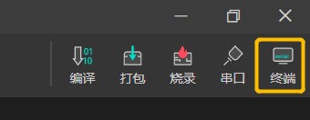
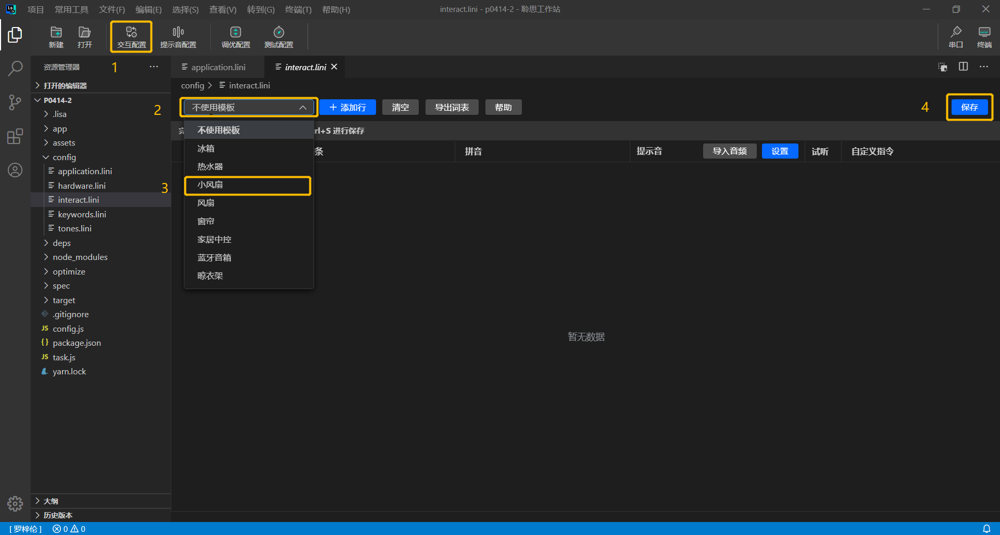
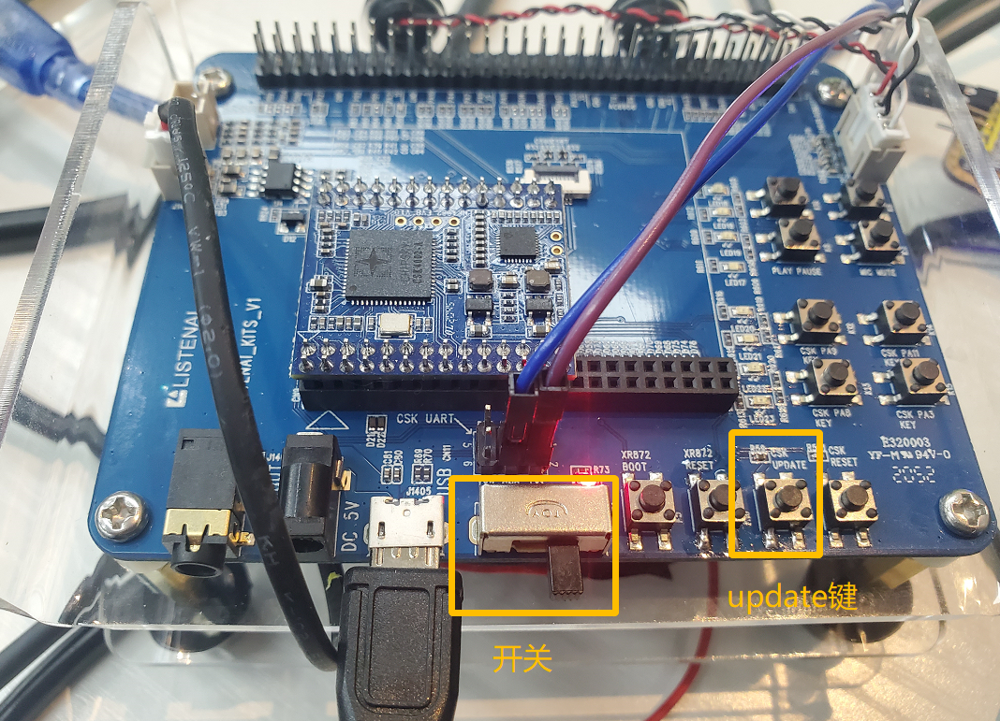

---

id: getting_start
title: CSK项目开发快速入门 V2
slug: /getting_start

---


> 通过本篇你将通过一系列具体的示例操作了解到：
1. 如何完成 LStudio 环境配置；
2. 如何使用 LStudio 创建项目并完成简单的固件配置；
3. 如何使用 LStudio 把固件烧录到 LSKits，得到一个小风扇语音交互 demo；
4. 如何使用简洁语法实现：在获取回调后，定义 GPIO 控制外围器件。

## 1. 做好准备


### 1.1 下载安装 LStudio

点击[此处](https://castor.iflyos.cn/castor/v3/lstudio/download)下载 LStudio 安装包，依次点击 “下一步” 直至安装完成。

### 1.2 登录


使用聆思账号密码登录，如果没有账号请先注册。

### 1.3 安装驱动


点击左上方常用工具，安装烧录驱动。


### 1.4 准备 LSKits 开发板

你需要拿到一个聆思官方的开发板，请关注聆思科技公众号（LISTENAI）或联系聆思商务团队获取。

在得到 LSKits 开发板后，组装视频可以参考这个视频：[聆思开发板 LSKits 组装说明](https://www.bilibili.com/video/BV1po4y1d7fB)


## 2. 制作第一个 CSK 固件

你将学会动手创建一个 CSK 固件，请按照文档说明逐步操作。

### 2.1 创建项目

#### 打开命令行终端

接下来一些列的操作需要用到命令行进行操作。你可以在 LStudio 界面右上角点击「终端」按钮唤起系统终端。也可以使用 `Ctrl + ~` 打开 LStudio 内置的终端。




#### 检查 LISA 环境

LISA(Listenai Software Architecture)是聆思智能提供的软件框架，支持客户通过命令行工具使用并管理聆思提供的软件包。CSK 项目的创建也依赖 LISA 环境。

在终端输入命令行 `lisa -v`，看到 LISA 版本号，代表 LISA 准备就绪

```shell
> lisa --version
@listenai/lisa/1.3.8 win32-x64 node-v14.15.4
```

#### 选择创建项目的路径 

项目创建需要指定的路径创建项目。请使用 `cd` 命令指定路径，如：

```shell
> cd C:\Users\oralzl\项目文件夹
```

#### 输入创建命令

请使用这个命令创建项目 `lisa create newProject -t @generator/csk`

- `lisa create` 是 `lisa` 用于创建项目的命令
- `newProject` 代表项目文件夹名称，可自定义。仅支持英文数字、下划线、`-`
- `-t` 代表使用模板（template）创建项目
- `@generator/csk` 是CSK语音交互项目的标准模板

输入创建命令之后，创建模板会提供架手架配置项目所需其他软件包。

请依次选择 `@source/csk4002`、`3.1.4`、`@board/lskits-csk4002`、`@algo/csk4002-cae-mlp`

```shell
> lisa create newProject -t @generator/csk
  √ 项目创建准备
  √ 初始化安装依赖
? 选择芯片方案 @source/csk4002
? 选择基础固件版本 3.1.4
? 选择板型模版 @board/lskits-csk4002
? 选择算法模  @algo/csk4002-cae-mlp
  √ 创建csk开发项目目录/文件
  √ 安装源码/必要依赖
  √ 源码初始化
  √ lskit配置准备
  √ 算法配置准备
```

完成项目创建之后，LStudio 会自动打开新项目。


### 2.3 资源配置

为了实现语音交互，你需要添加自定义唤醒词和命令词。为方便开发者快速实现产品开发，我们提供了近20个常用设备场景模板，品类涵盖冰箱、空调和风扇等（持续丰富中）。请点击「顶部工具栏-交互配置」，选择**小风扇**模板然后点击「保存」。如下图所示：



### 2.4 固件打包

接下来需要对固件进行打包。

在当前项目中，打开命令行终端，输入 `lisa build` ，触发固件构建流程。

```shell
> lisa build
  √ 固件编译
  √ 编译respak.bin
  √ 打包lpk包
```

**LPK 文件是最终构建产物，可用于 LISA 烧录**

### 2.5 固件烧录

最后，你需要将打包好的固件烧录进 LSKits。你可以先查看演示视频：[聆思开发板LSKits固件烧录说明](https://www.bilibili.com/video/BV18T4y1P7Pm)。



1. **请准备 micro-usb 数据线**（请注意不是圆口电源线，某些 USB 线无法进行数据传输，需要确认排查），使用 USB 数据线连接 LSKits 与电脑，关闭 LSKits 开关（左拨）；

2. **按住** LSKits 上的 **update** 键，再打开开关（右拨），**先不要松开 update 键**；

3. 在当前项目中，打开命令行终端，输入 `lisa flash` ，触发固件烧录流程。

```shell
> lisa flash
  √ 解压LPK文件
  √ 解析配置文件
bin list > flashboot(0),master(0x10000),script(0xf0000),respak(0x100000)
[-]设备请进入烧录模式...
烧录分区 1｜ ████████████████████████████████████████ | 17.85 KB/17.85 KB | flashboot(0)
烧录分区 2｜ ████████████████████████████████████████ | 475.84 KB/475.84 KB | master(0x10000)
烧录分区 3｜ ████████████████████████████████████████ | 3.91 KB/3.91 KB | script(0xf0000)
烧录分区 4｜ ████████████████████████████████████████ | 4370.25 KB/4370.25 KB | respak(0x100000)
烧录完成
```


4. 烧录完成后，按击 LSKits 的 **reset** 键，新烧录的固件即可生效。


:::tip 若烧录失败，请检查：
1. 是否已准确执行上方烧录流程；
2. 是否已安装烧录驱动；
3. 请确保 LSKits 上的芯片型号是4002；
4. 烧录或者重启的时候，需要把串口拔掉。硬件上串口电源会倒灌，可能引起无法重启或者烧录；
5. 若连续烧录失败，请联系FAE/提交工单寻求帮助。
:::

### 2.6 “你好哈利！”

恭喜你得到了第一个固件。现在你可以使用唤醒词**你好哈利**和**交互配置中的命令词**与 LSKits 进行交互了。

你也在 LStudio 集成的串口工具中查看语音交互过程中的日志。你需要先自备串口连接电脑与 LSKits。

如下图，**串口 RXD** 接 **LSKits TX1**，**串口 GND** 接 **LSKits GND**。


在串口完成对接后，打开 LStudio 串口工具，打开检测到的串口，即可看到交互过程中的日志：


## 3. 点亮 LED 灯

相信你已经能够体验到风扇 demo 的语音交互了，但好像还不能真正实现风扇控制。在项目开发中，我们需要根据被控设备芯片通信协议（如 UART/I2S/PWM 等）进行开发。为演示与被控设备通信，我们通过点亮 LSKits 上一个 LED 灯来展示通信方式的实现。

### 3.1 注册回调事件并配置引脚

> 在这一小节中，你将实现在用户主程序中注册系统回调，在回调中完成意图发送。

在项目目录找到 `app/app_main.c` 文件:

1. 在识别回调函数 `cb_esr_recognition` 中使用函数 `csk_script_handle_intent` ，发送当前的意图给 `ScriptEngine` 处理（可通过取消源码注释打开功能）;

```c
static void
cb_esr_recognition(keyword_attrs_t *key_attrs)
{
	CLOGD("[APP]ESR Recognition: kid=%d", key_attrs->kid);

	// 如需在 ScriptEngine 中处理指令，取消下面这一行的注释
	csk_script_handle_intent(key_attrs->txt);
}
```

2. 继续在`app_main`中进行修改（可通过取消源码注释打开功能）
   
* 使用`csk_handler_register(CSK_EVENT_WAKE_UP, cb_wake_up)`注册唤醒回调;
   
* 使用`csk_handler_register(CSK_EVENT_ESR_RECOGNITION, cb_esr_recognition)`注册识别回调；

* 使用 `pinmux_config` 配置芯片管脚的功能; 

	* 配置使用芯片管脚 `PIN42` ，选用功能2（GPIO 功能），输出方向。
  
```c
void
app_main(void)
{
	CLOGD("[APP]Hello world");

	// 唤醒和命令词相关回调，取消注释使用
	csk_handler_register(CSK_EVENT_WAKE_UP, cb_wake_up);
	csk_handler_register(CSK_EVENT_ESR_RECOGNITION, cb_esr_recognition);
	
	// 如使用 PIN42的GPIO功能来驱动LED20，取消下面这一行的注释
	pinmux_config(42, 0);  // LED20
}
```


### 3.2 驱动GPIO进行LED控制

> 在这一小节中，你将使用轻量级语法，在脚本中捕获意图, 并进行GPIO的控制。

**捕获命令词「打开风扇」后，点亮 LED20**

你可以在 `app/scripts/intents.rb` 定义业务逻辑。先修改第一个示例方法：
1. 把 `on_intent` 后的命令词修改为需要捕获的`打开风扇`；
2. 同步修改日志打印内容 `EngineCore.logger.info "打开风扇"`;
3. 取消 `IO.set 42, :low` 的注释，实现点亮 LED20；

```js
on_intent "打开风扇" do
  EngineCore.logger.info "打开风扇"
  
  # 点亮 LED20
  IO.set 42, :low
end
```

**捕获命令词 「关闭风扇」 后，熄灭 LED20**

然后修改第二个示例方法，定义捕获**关闭风扇**后的交互。

```js
on_intent "关闭风扇" do
  EngineCore.logger.info "关闭风扇"

  # 熄灭 LED20
  IO.set 42, :high
end
```

你可以在LStudio 使用轻量级语法实现业务配置，可以查看[CSK SDK使用示例](https://open.listenai.com/csk_sdk_demo) 。

还有更详尽的API文档，你可以查看[EngineCore API](https://open.listenai.com/csksdk/csk4002/mruby/table_of_contents.html)。

### 3.3 体验新的效果


由于上述步骤已经修改了 `./app` 中的代码，请务必在工具栏点击「编译」，对代码进行重新编译。
在编译完成后，依次进行**固件打包、固件烧录**。

烧录完成后重启开发套件，当命中**打开风扇**后，LED20 灯光会同步亮起；当命中**关闭风扇**后，LED20 灯光会同步熄灭。


你也可以在串口终端查看到通过  `ScriptEngine` 定义出的日志，如 `[I][SCRIPT]打开风扇 `。


## 了解更多


为了快速定制扩展语音项目，你可能对以下内容也感兴趣：

- [自定义词表与回复语](http://open.listenai.com/vui) 

- [如何使用LStudio实现自定义业务开发](http://open.listenai.com/csk_sdk_demo) 

- [如何使用LStudio修改基础配置](https://open.listenai.com/guides/firmware/base_config) 

你可以通过以下材料进一步了解 LSKits：

- [LSKits硬件使用指导手册.pdf](https://open.listenai.com/resource/open/doc_resource%2F%E7%A1%AC%E4%BB%B6%E8%AE%BE%E8%AE%A1%E6%8C%87%E5%8D%97%2F%E5%8E%9F%E7%90%86%E5%9B%BE%26PCB%E8%AE%BE%E8%AE%A1%E5%8F%82%E8%80%83%2FLSKits%E7%A1%AC%E4%BB%B6%E4%BD%BF%E7%94%A8%E6%8C%87%E5%AF%BC%E6%89%8B%E5%86%8C.pdf)

- [下载 LSKits 参考设计](https://open.listenai.com/resource/open/doc_resource%2F%E7%A1%AC%E4%BB%B6%E8%AE%BE%E8%AE%A1%E6%8C%87%E5%8D%97%2F%E5%8E%9F%E7%90%86%E5%9B%BE%26PCB%E8%AE%BE%E8%AE%A1%E5%8F%82%E8%80%83%2FLSKits%E5%8F%82%E8%80%83%E8%AE%BE%E8%AE%A1.zip)

- [LSKits BOM.zip](https://open.listenai.com/resource/open/doc_resource%2F%E7%A1%AC%E4%BB%B6%E8%AE%BE%E8%AE%A1%E6%8C%87%E5%8D%97%2F%E5%8E%9F%E7%90%86%E5%9B%BE%26PCB%E8%AE%BE%E8%AE%A1%E5%8F%82%E8%80%83%2FLSKits%20BOM.zip)

在项目开发过程中如果需要帮助，可以通过工单系统向我们获取技术支持：

- [工单系统](https://open.listenai.com/cloud_project) 


