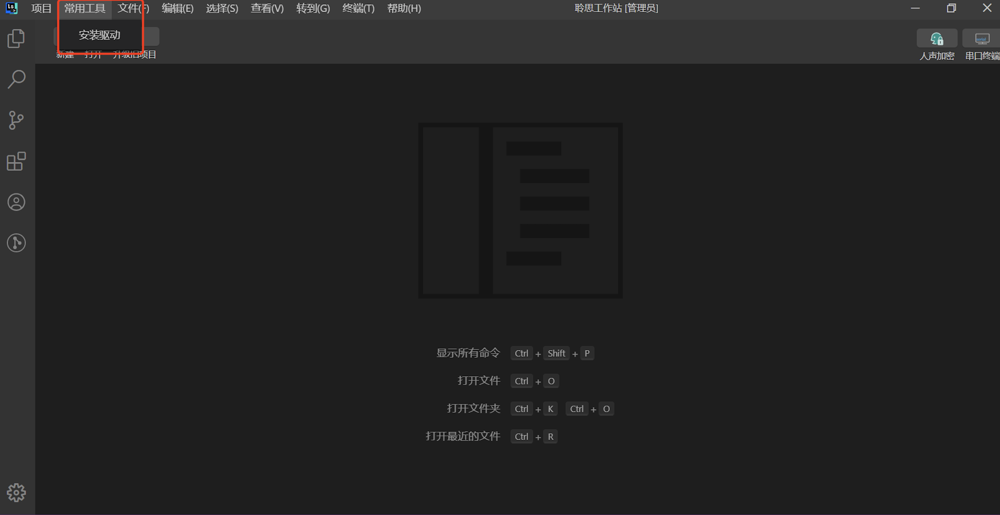
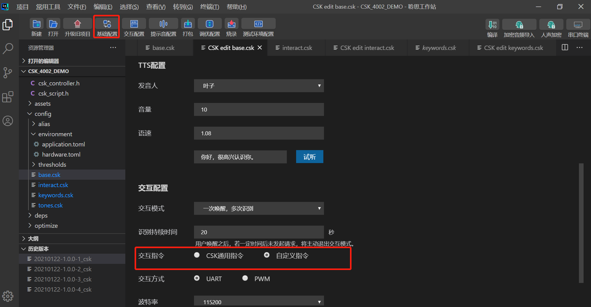
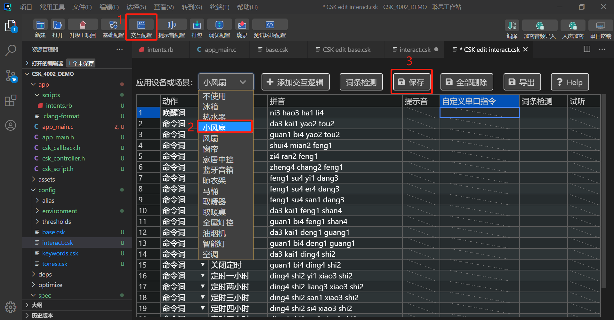
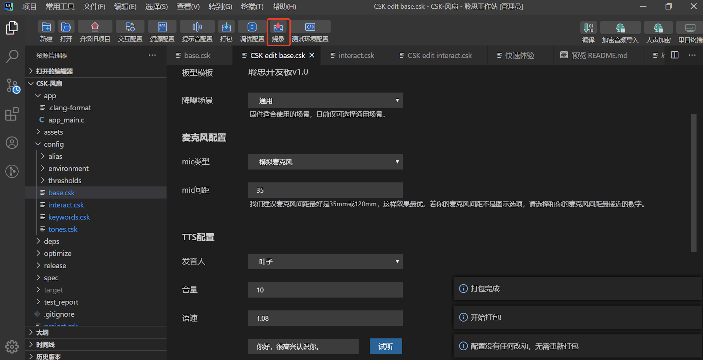

---

id: getting_start
title: CSK项目开发快速入门
slug: /getting_start

---


> 本篇介绍你如何快速上手使用集成开发环境（LStudio）创建一个项目，并在开发板（LSKits）上运行起来，完成你的第一个CSK项目。
>
> 看完本篇你将了解到：
>
> 1. 如何使用LStuido创建项目并进行简单的配置。
>
> 2. 如何使用LStuido打包并烧录固件，实现风扇产品demo并进行离线语音交互。

## 1. 做好准备

### 1.1 下载安装LStudio

点击[此处](https://castor.iflyos.cn/castor/v3/lstudio/download)下载安装包，依次点击 “下一步” 直至安装完成。

### 1.2 登录


使用聆思账号密码登录。


### 1.3 安装git

进入LStudio界面后，请按照提示安装git客户端。

### 1.4 安装驱动



点击左上方常用工具，安装烧录驱动。

### 1.5 安装vc++环境依赖

请下载 [vc++依赖](https://cdn.iflyos.cn/docs/lstudio_extension.zip)并依次安装。

### 1.6 获取LSKits开发板

你需要拿到一个聆思官方的开发板，请关注聆思科技公众号（LISTENAI）进行购买。


## 2. 开始制作第一个CSK固件

你将马上学会创建一个CSK风扇语音交互项目，阅读该部分的最佳方法是一步步跟着操作，所有这些步骤都是可视化配置的，不需要额外编写代码或者其他操作。

### 2.1 创建项目


创建一个新的项目，流程如下：
1. 输入工程名称：CSK4002风扇
2. 选择工程目录。
3. 选择芯片型号：4002。
4. 选择基础固件版本：2.0.2。
5. 选择板型模板：聆思开发板V1.0。

:::tip

工程名称不可包含空格或其他特殊符号。

:::

### 2.2 基础配置

接下来，点击工具栏左上角的“基础配置”来选择你想使用的配置，如下图。交互指令选择“自定义指令”，其它暂时使用默认配置。当然在这里你也可以通过修改TTS配置和交互配置等实现个性化效果。



:::tip

1. 麦克风请根据实际硬件选型进行配置，LSKits默认使用模拟麦克风、间距为35mm。
2. 若需要使用自定义串口协议，可以在交互指令处选择自定义指令。使用自定义串口指令请参考

:::

### 2.3 资源配置

上面我们已经为Liskits配置好了基础硬件信息，为了能让它识别唤醒词和命令词，接下来我们需要添加自定义唤醒词和命令词。为了方便开发者快速实现，我们提供了近20个常用设备场景，品类涵盖冰箱、空调和风扇等。在此我们直接选择“小风扇”模板、保存。如下图所示。



### 2.4 固件打包

你已完成了一个固件应该配置的所有内容，接下来需要对固件进行打包。


1. 点击LStudio上方工具栏的固件打包。


2. 输入固件打包版本号。


3. 等待固件打包完成（3~5min）。

:::tip

打包过程中请不要关闭LStudio。

:::

### 2.5 固件烧录

最后一步，我们需要将打包好的固件烧录进LSKits。


1.  使用usb连接Liskits与电脑。断电关机后按住update键，再开机，看到程序开始烧录后，可以松开update键。



2. 点击工具栏-烧录。


3. 等待固件烧录（1~2min），完成后将会显示PASS。

:::tip

若烧录失败，请检查：
1. 是否已准确执行上方烧录流程。
2. 是否已按1.4步安装相关驱动。
3. 请确保LSKit上的芯片是4002。
4. 若连续烧录失败，请联系FAE/提交工单寻求帮助。

:::

### 2.6 “你好哈利！”

现在，你可以使用唤醒词“你好哈利”和“交互配置”中的命令词和LSKit进行交互了。如果一切顺利，恭喜你完成了第一个CSK语音项目的制作。


## 3. 点亮LED灯

经过以上步骤，相信你已经能够体验到风扇demo的语音响应了，但好像不能真实的实现风扇控制。在实际项目开发中我们需要根据被控设备芯片通信协议（一般是IO操作，如UART/I2S/PWM等）进行开发。为表示与被控设备通信，我们通过点亮LSKits某一个LED灯来模拟这种情况。

### 3.1 注册回调事件并配置GPIO口（LED20引脚）

展开工程目录找到app/app_main.c文件，打开唤醒词、命令词和LED20 pin脚配置，如下图所示。

```js
void
app_main(void)
{
	CLOGD("[APP]Hello world");

	// 唤醒和命令词相关回调，解除注释使用
	 csk_handler_register(CSK_EVENT_WAKE_UP, cb_wake_up);
	 csk_handler_register(CSK_EVENT_ESR_RECOGNITION, cb_esr_recognition);
	// csk_handler_register(CSK_EVENT_ESR_TIMEOUT, cb_esr_timeout);

	// 语音播报相关回调，解除注释使用
	// csk_handler_register(CSK_EVENT_PLAYER_START, cb_player_start);
	// csk_handler_register(CSK_EVENT_PLAYER_FINISH, cb_player_finish);

	// 如使用 UART，解除下面这一行的注释
	// uart_init();

	// 如使用 LED20，解除下面这一行的注释
	pinmux_config(42, 0);  // LED20
}
```

### 3.2 GPIO口操作实现LED20 控制

LStudio支持使用轻量级语法实现业务配置，具体可查看[CSK SDK使用示例](https://open.listenai.com/csk_sdk_demo) 。

修改 `app/scripts/intents.rb`为以下内容:

```js
on_intent "打开风扇" do
  EngineCore.logger.info "打开风扇"

  # 点亮 LED20
  IO.set 42, :low
end

on_intent "关闭风扇" do
  EngineCore.logger.info "关闭风扇"

  # 熄灭 LED20
  IO.set 42, :high
end

default_intent do |intent|
  EngineCore.logger.info "default_intent: #{intent}"
end
```


### 3.3 重新打包烧录

再次固件打包，进行体验。如果一切正常，你会发现当你用“打开风扇”控制时，LSKits开发板LED20灯光打开，“关闭风扇”时灯光关闭。


## 4. 学习更多开发知识

为了快速定制扩展语音项目，你可能对以下内容也感兴趣：

- [自定义词表与回复语](http://open.listenai.com/vui) 

- [如何使用LStudio实现自定义业务开发](http://open.listenai.com/csk_sdk_demo) 

- [如何使用LStudio修改基础配置](https://open.listenai.com/guides/firmware/base_config) 

在项目开发过程中如果需要帮助，可以通过工单系统向我们获取技术支持。

- [工单系统](https://open.listenai.com/cloud_project) 


