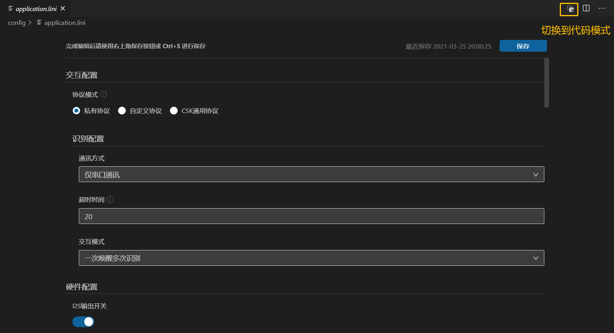
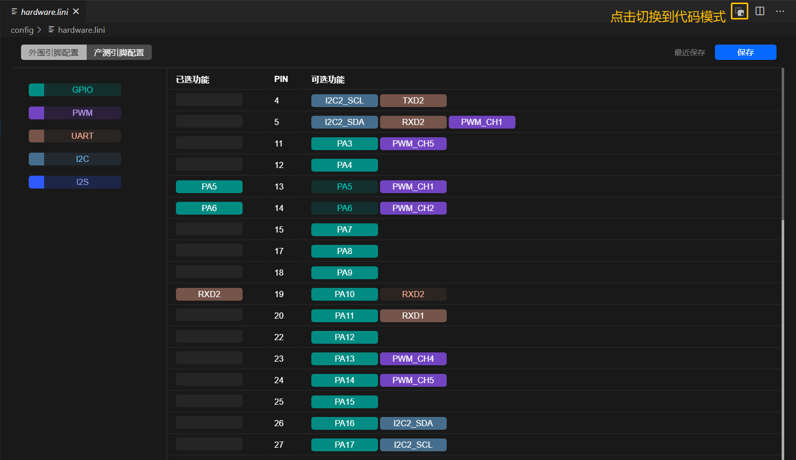

## 获取LISA环境

下载并安装LStudio 2.3.1 版本，即可以完成配置所有运行 LISA 所需的环境配置。[点击这里下载](https://iflyos-external.oss-cn-shanghai.aliyuncs.com/public/lstudio/alpha/LStudioInstaller-2.3.1-beta.exe)


如果之前已经在更早版本的 LStudio 登录过，安装新版本后**请重新登录**。


**检查 LISA**
1. 在 LStudio 打开终端
2. 输入命令行 `lisa -v`，看到 LISA 版本号，代表 LISA 环境正常
```shell
PS C:\Users\oralzl\项目文件夹> lisa -v
@listenai/lisa/1.3.4 win32-x64 node-v12.21.0
```

## 使用 LISA 命令行创建 CSK 项目

接下来正式介绍如何使用  `lisa create` 命令创建 CSK 项目

### 选择创建项目的路径 

`lisa create` 会在当前命令行所指定的路径创建项目。所以在创建项目之前请使用 `cd` 命令指定路径。

```shell
PS C:\Users\oralzl\> cd C:\Users\oralzl\项目文件夹
PS C:\Users\oralzl\项目文件夹> 
```

### 输入创建命令

命令示例：`lisa create newProject -t @generator/csk`

- `newProject` 代表项目文件夹名称，可自定义。仅支持英文、数字与下划线
- `-t` 代表使用模板（template）创建项目
- `@generator/csk` 是CSK语音交互项目的标准模板

输入创建命令之后，创建模板会提供架手架配置项目所需其他软件包。

```shell
PS C:\Users\oralzl\Desktop\芯片业务\项目工程文件> lisa create newProject -t @generator/csk
  √ 项目创建准备
  √ 初始化安装依赖
? 选择芯片方案 @source/csk4002
? 选择基础固件版本 3.1.4
? 选择板型模版 @board/lskits-csk4002
? 选择算法模  @algo/csk4002-cae-mlp
  √ 创建csk开发项目目录/文件
  √ 安装源码/必要依赖
  √ 源码初始化
  √ lskit配置准备
  √ 算法配置准备
```

完成项目创建之后，请使用 LStudio 打开新的项目。

### 项目结构简介

 **`.\config` 文件夹含有项目所需要的配置文件，包括:**
- `application.lini` 与固件源码配套的应用配置，已全面支持可视化配置
- `hardware.lini` 硬件引脚配置文件，已支持可视化配置
- `interact.lini` 语音交互配置
- `keywords.lini` 唤醒词/命令词阈值配置
- `tones.lini` 提示音配置

**`alias` 与 `thresholds` 文件夹已移动到 `deps` 文件夹中**

**`.\.lisa` 文件夹会记录 lisa 产生的日志**

**`package.json` 可以看到项目中的相关依赖**
```
{
  "name": "newProject",
  "version": "1.0.0",
  "description": "",
  "author": "",
  "license": "ISC",
  "lisa": {},
  "dependencies": {
    "@algo/csk4002-cae-mlp": "^1.0.1",
    "@board/lskits-csk4002": "^1.0.2",
    "@generator/csk": "^1.1.5",
    "@listenai/lisa_core": "^1.1.0",
    "@source/csk4002": "3.1.3-beta.2"
  }
}
```

## 固件构建与烧录

### 配置词表资源

- 打开 `.\config\interact.lini`
- 选择**小风扇**模板
- 点击保存

### 使用 LISA 构建固件

在当前项目中，打开命令行终端，输入 `lisa build` ，触发固件构建流程。

```shell
PS C:\Users\oralzl\Desktop\芯片业务\项目工程文件\newProject> lisa build
  √ 固件编译
  √ 编译respak.bin
  √ 打包lpk包
```

**LPK 文件是最终构建产物，可用于 LISA 烧录**

### 使用 LISA 烧录固件

在当前项目中，打开命令行终端，输入 `lisa flash` ，触发固件烧录流程。

关于 LSKits的相关操作，可以参考[这份文档](https://open.listenai.com/getting_start#25-%E5%9B%BA%E4%BB%B6%E7%83%A7%E5%BD%95)。

```shell
PS C:\Users\oralzl\Desktop\芯片业务\项目工程文件\newProject> lisa flash
  √ 解压LPK文件
  √ 解析配置文件
bin list > flashboot(0),master(0x10000),script(0xf0000),respak(0x100000)
[-]设备请进入烧录模式...
烧录分区 1｜ ████████████████████████████████████████ | 17.85 KB/17.85 KB | flashboot(0)
烧录分区 2｜ ████████████████████████████████████████ | 475.84 KB/475.84 KB | master(0x10000)
烧录分区 3｜ ████████████████████████████████████████ | 3.91 KB/3.91 KB | script(0xf0000)
烧录分区 4｜ ████████████████████████████████████████ | 4370.25 KB/4370.25 KB | respak(0x100000)
烧录完成
```

## LISA CSK 项目的新功能

通过 `lisa create` 创建的新 CSK 项目，可以使用到以下新功能。

### application 图形化配置

- 支持对 `application.lini` 进行图形化配置（默认）
- 点击右上角切换按钮可以回到代码模式进行编辑




### hardware 图形化配置

- 支持对 `hardware.lini` 进行图形化配置（默认）
- 图形化配置提供的配置规则检查与提醒，有效防止误操作
- 点击右上角切换按钮可以回到代码模式进行编辑




